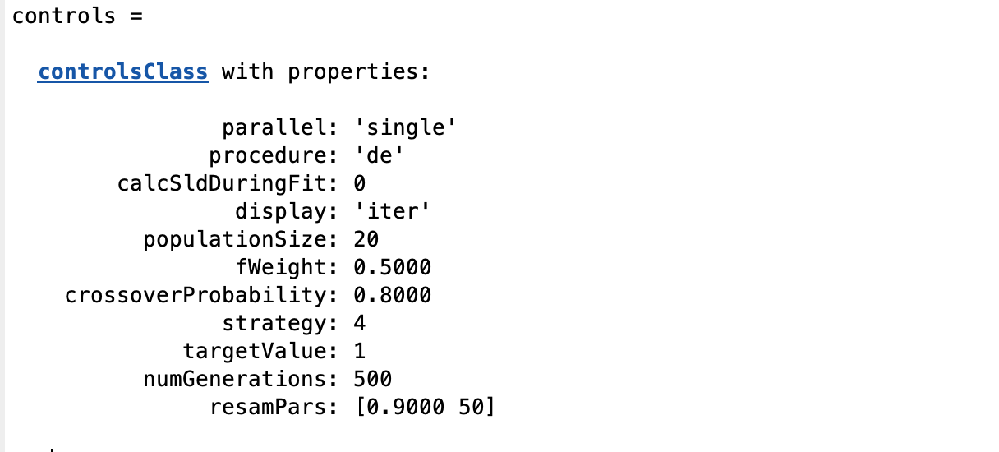

.. _DE:

Differential Evolution
......................

Differential evolution (DE) is a method that optimizes a problem by iteratively trying to improve a candidate solution with regard to a given measure of quality. It is an
example of a 'genetic algorithm', whereas the principles of Darwinian Evolution are used to 'evolve' the correct solution from an initial set of guesses.

DE is used for multidimensional real-valued functions but does not use the gradient of the problem being optimized, which means DE does not 
require the optimization problem to be differentiable, as is required by classic optimization methods. 

DE optimizes a problem by maintaining a population of candidate solutions and creating new candidate solutions by combining existing ones according to its simple formulae, 
and then keeping whichever candidate solution has the best score or fitness on the optimization problem at hand. In this way, the optimization problem is treated as a black box 
that merely provides a measure of quality given a candidate solution and the gradient is therefore not needed.

As with all the RAT algorithms, DE is selected using the 'procedure' attribute of the controls block:-

.. code:: MATLAB

    controls = controlsClass();
    controls.procedure = 'DE'

This reveals the DE specific parameters in controls:- 

For all the algorithms in the RAT implementation of DE (see below), the parameters have the following meanings:-

populationSize - For DE a number of sets of parameters (population) evolve using random mutation, or exchange of
                 parameters (analogous to genes!) between the members of the poulation.

numGenerations - How many iterations of DE to run.

crossoverProbability - The probability of exchange of parameters between individuals at each generation (value between [0 - 1]).

fWeight - A weighting value controlling the stepsize of mutations.

strategy - The algorithm used (see below).

DE is also somewhat sensitive to
the choice of the stepsize fWeight. A good initial guess is to
choose fWeight from interval [0.5, 1], e.g. 0.8. The crossover
probability (between 0 -1) helps to maintain
the diversity of the population but should be close to 1 for most. 
practical cases. Only separable problems do better with CR close to 0.
If the parameters are correlated, high values of F_CR work better.
The reverse is true for no correlation.

The number of population members I_NP is also not very critical. A
good initial guess is 10*I_D.

The 'strategy' selects between variations in the actual selection agorithm.
The options are:-

#. DE/rand/1.             
#. DE/local-to-best/1.             
#. DE/best/1 with jitter.  
#. DE/rand/1 with per-vector-dither           
#. DE/rand/1 with per-generation-dither
#. DE/rand/1 either-or-algorithm

