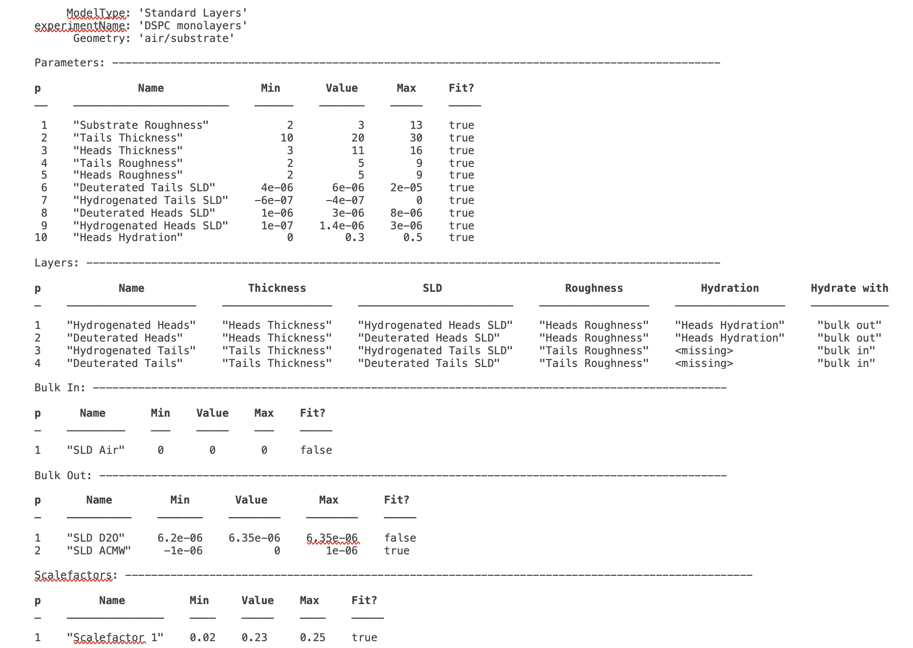
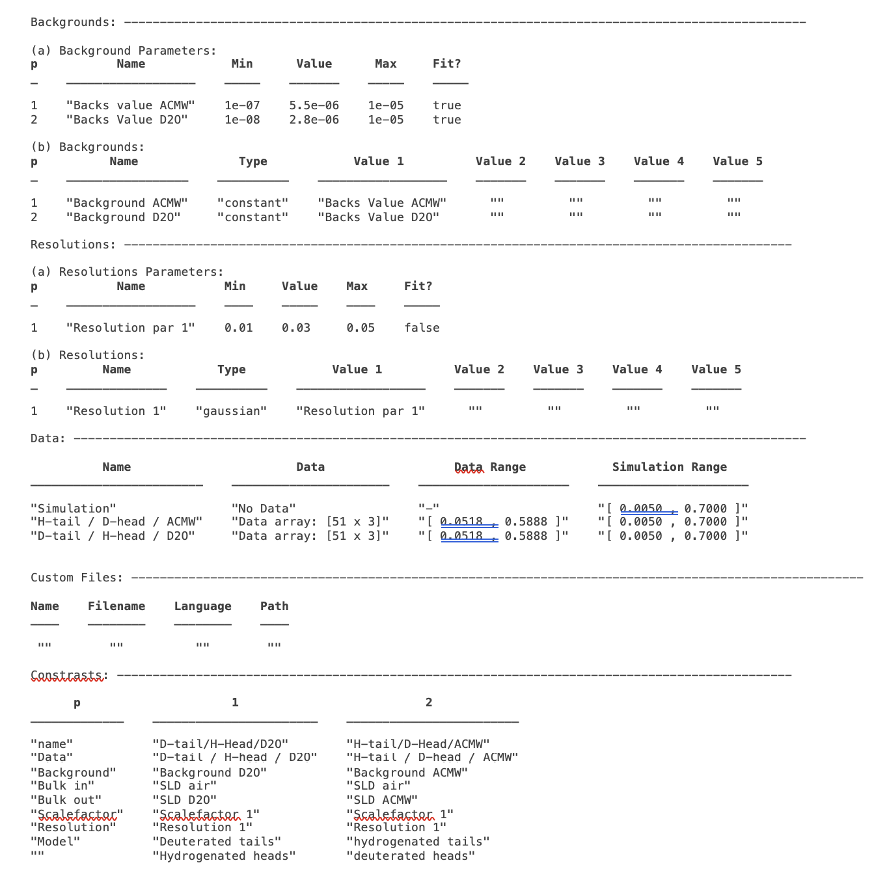
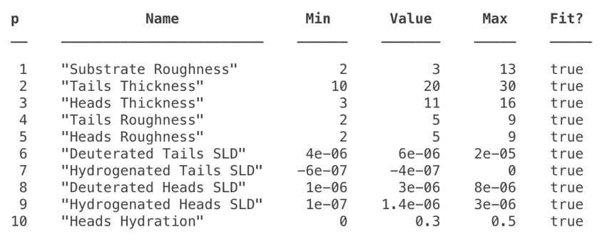
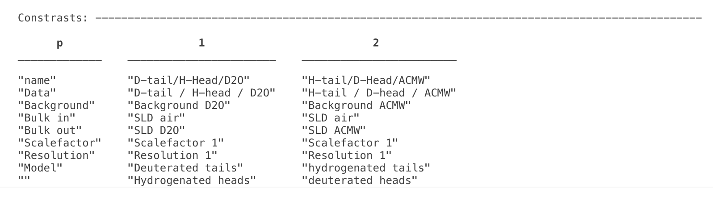
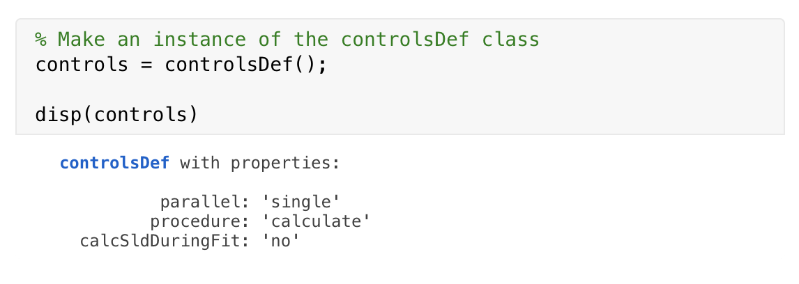
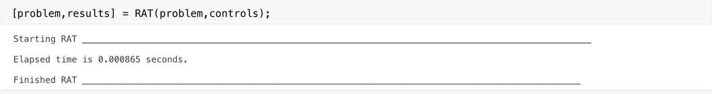
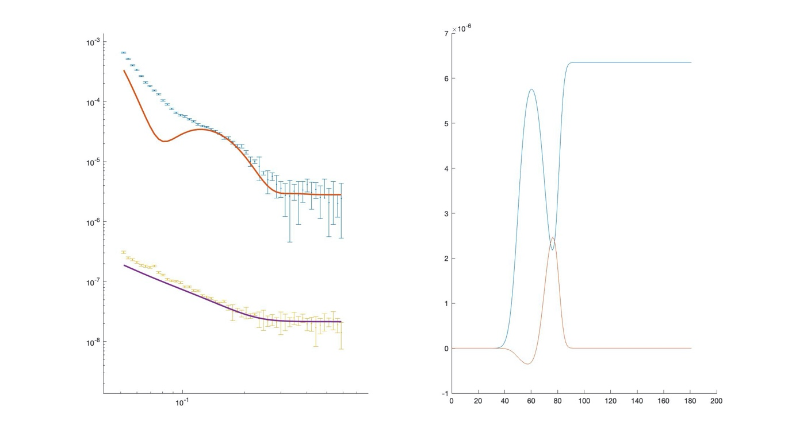

.. _chapter1:

Introduction
............
For any calculation problem, the process of interacting with our data …… xxxx

Basic modelling principle
=========================
Even when we are at the calculations point our data analysis - that the data has been properly reduced and we have some idea of a modelling strategy, we can still then split the problem specification into two parts.

* The **Model Definition** describes our data, our model, the various parameters we may have along with their limits or priors, and other quantities such as bulk SLD's or backgrounds.
* The **Controls Block** summarises the actions which we want to do with our model. So it specifies which algorithm we might want to apply to improve our model fit, along with algorithm parameters such as maximum function evaluations or gradients etc.

Keeping these two separate gives a high degree of flexibility as to how we can approach a data analysis problem. For example, suppose we have defined a Model Definition block which contains the data and model details for a given fitting problem, we then decide that we would like to optimise this first using a genetic algorithm, and then run a Bayesian analysis to obtain the parameter posterior distributions. To do all this we only need to define our model once, and run it twice whilst simply modifying the Controls Block to tweak the algorithm that is run in each case. Also, once we are satisfied with our model, we can save it or export it, and re-use this basic pattern for subsequent analyses with different, related data sets. Keeping the Model and Controls separate gives a high degree of flexibility as to how tasks can be formulated and run.

So, an input into RAT always conforms to this picture: a model definition class to specify the problem, and a controls definition class that tells RAT what analysis task you would like to do:

.. image:: images/userManual/chapter1/ratInput.png
    :alt: RAT input model

The outputs are always another *problemDef* class, and a results block. The new *problemDef* class is identical to the inputted one, except with updated values of the fitted parameters (e.g. after running a fit). The results block as a set of arrays containing the results of the calculations, such as simulated reflectivities, SLD profiles or parameter distributions. We will discuss more about these in the next chapter where we look at the outputs in more detail. Similarly, we will look in more detail at the input classes in Chapter 2.

In the next section, we will look at an example calculation, in order to introduce the basics of the RAT toolbox. Before we proceed, it's useful to keep a couple of things in mind:

* **Coding language:** It's in Matlab - Well, yes and no! The RAT toolbox is written completely in C++ (including calling of custom model scripts), and so in principle can be called from any language. So for each case, we have the input classes and scripts (Matlab in our example), which are then parsed into a form that C++ understands (*mex* interface for Matlab). The C++ carries out the calculation, and then the reverse happens, where the output from the C++ calculation is converted back to a Matlab format. This collection of input classes and routines for communicating between Matlab and the underlying C++ are called the **Matlab API**. This manual details the use of the **Matlab API** to use RAT. However, the scheme in the figure above could just as easily be for any language. So, some Python versions of the *problemDef* classes, along with some interface routines to communicate between Python and C++ would constitute a Python API for this toolbox. We are planning to provide four choices of API for RAT: *Matlab, Octave, Python and Java*. For the first release, only the **Matlab API** is currently available.

* **What about different model types?** - There are many possible types of model, and this is done by having more than one version of the *problemDef* class. These are (those in italics not initial release):

    * Standard Problem: Problem types which are well described by a non-polarised beam, with no absorption (i.e., real refractive index only). 
    * *Standard Problem with Absorption*
    * *Domains Problem Type*
    * *Oil/Water problem type*
    * *Polarised problem type*

Within each problem class, there is the option of *Custom Layer* or *Custom XY* model definitions. These will be discussed in more detail in chapter 3.

An example - A simple model of a lipid layer
============================================

**(a) Specifying the Model.**

In the next chapter, we'll look in detail how to set up the problem definition for a given situation. Initially though, it's useful to take a pre-prepared problem definition, and to see how this is then used in RAT. As an example, we'll use some neutron reflectivity data for a lipid monolayer, collected at various deuterations, which we want to analyse simultaneously.

In terms of reflectivity, the interface we want to model (i.e. a monolayer at an air-water interface) is usually well modelled by two layers: the hydrophobic tail regions of the lipids, which locate outside the bulk water interface, and the hydrophilic heads which are adjacent (or embedded) in the bulk aqueous phase. 

In our example, the layers can be either deuterated of hydrogenated, and the bulk water can either be D2O or ACMW.

.. image:: images/userManual/chapter1/lipidMonolayer.png
    :alt: The lipid monolayer example

We are going to analyze our monolayer data using a RasCAL type *standard layers* model, in that we identify which parameters we need to describe the model, group these into layers (which are defined as a thickness, roughness, SLD and hydration), and then group the layers along with data into contrasts. The advantage of this approach is that it's simple to share parameters between layers, so a layer representing deuterated headgroups should share the same thickness and roughness parameters as a layer representing hydrogenated heads, but they should differ from each other in their SLD. 

The problem definition in RAT is done by making an instance of a *projectClass* object, and then using the class methods to set up the parameters, layers and so on this instance. The details of setting up a *projectClass* object is discussed in chapter 2, but for now, we'll look at a pre-prepared example.

.. code:: MATLAB

    % Load in a pre-made problem Definition class
    problem = load('twoContrastExample.mat');
    problem = problem.problem;

    % Have a look at what we have
    disp(problem)

This may initially look quite complicated, but it is fairly self-explanatory in terms of representing a typical RasCAL model (and should make sense to anyone familiar to the RasCAL gui, with some thought). The various aspects of the model definition are grouped together, then eventually combined to make our contrasts. These groups are:

1. **The Parameters Group -** This block defines all the parameters that we need to specify our model. In our layers case, we need 10 parameters to define our system: A bulk interface roughness, thickness and roughness for the headgroups and tails, and SLD values for the layers, depending on whether they are deuterated or not. In this block we also define the parameter values and their allowed ranges, and specify if they are included in the fit:-

2. **The Layers Group -** Once we have our parameters, we then need to group these into layers, in traditional RasCAL style. For our model, we always have two layers - a headgroup and the associated tails. Each of which can be deuterated, so we set up 4 layers in total, sharing the parameters between the layers as necessary: 

.. image:: images/userManual/chapter1/layersGroup.png
    :alt: The layers group

3. **'Instrument' Parameters: (Backgrounds, scalefactors and resolutions) -** These are necessary to specify our model, and are specified in much the same way as the parameters. The background and resolutions blocks have a more complicated format to allow flexibility in how these are specified, which will be discussed further in chapter 2. These are the parameters that appear in the *experimental Parameters* tab of the RasCAL model builder, and are subsequently included in the definitions of the contrasts at the end of the worksheet.

|
 
4. **Data -** Each contrast has to have a dataset associated with it, whether or not it contains data or not. An empty data object (i.e. containing no data and just simulation ranges), means RAT will calculate the reflectivity only. When data is present, chi-squared will also be calculated. For our problem, we have two datasets and these are coded in to the data block ready to be incorporated into contrasts:

.. image:: images/userManual/chapter1/dataGroup.png
    :alt: The data group

5. **Contrasts -** Once we have defined all the components of our model, we need to group them together into contrasts. We have two datasets we want to consider, so two contrasts. We have the relevant instrument parameters, and also we specify which layers are included in each contrast (*model*). 

**(b) Running our Model.**

As implied from figure (1), running RAT requires not only our input model specification, but also a controls block telling RAT what to do. We will discuss the controls block in more detail in Chapter 4, but for this demo we will just make an instance of the controls block and modify a few parameters to run the demo:

This makes an instance of the *controlsDef* class we have called **controls**. The various properties of the class allow the type of calculation to be specified, in terms of parallelisation, choice of algorithm to be applied and so on. Here we are specifying a single threaded calculation of our reflectivities only (the default) - in other words we are not asking RAT to do any kind of fit with our parameters. We can now send our problem definition and controls classes to the RAT toolbox:

It is worth noticing here that this is always the general format for calling RAT. There are two inputs - a problem definition and a controls block, and the result is two outputs - another copy of the *controlsDef* class, and a new, *results* block. 

The *controlsDef* that returns is a copy of our input, except that the parameter values will be changed by any procedure done. So, if we run a simple fit, then the output *problemDef* will have the values of the best-fit parameters. Here, we are not doing any fitting yet, and so the output is an exact copy. Also, we overwrite out original input class with the output by using the same name ('problem') as an input and an output, but you don’t have to do it this way.

Once we've run our model through RAT, then the second output (we call *results* here) is an array which contains the output of the calculation (we will discuss this in more detail in chapter 4) :

.. image:: images/userManual/chapter1/dispResults.png
    :alt: disp(results)

This contains the results of our calculations, so for us including the SLD profiles and reflectivities calculated from our *problemDef* class. We can now plot the output, either manually (by taking the relevant parts from the *results* array), or using one of the supplied plotting utilities:

.. code:: MATLAB

    fig(1); clf;
    plotRefSLD(problem, results)

We can see that our model is looking fairly sensible, but that our guess values for the parameters are pretty wide off the mark.

To do something more than just simulating the reflectivity, we change the procedure we specify in the *controlsDef* class. At the moment, controls.procedure is set to **calculate**, which does a one-time calculation of the reflectivity given the current parameters only. To do a fit, we can just change the *procedure* attribute of our *controlsDef* from **calculate** to **simplex**, which reveals a new set of parameters in the *controlsDef* block.
