|RAT banner|

.. _chapter2:

Chapter 2 - The Problem Definition Input Class.
...............................................

1. Basics
=========

In the previous chapter, we saw an example of how we set up and run an analysis using the RAT toolbox. Every call to the toolbox has two parts: the problem definition class, where we define the model, add the data and define our contrasts, and the Controls Class where we tell the toolbox what type of analysis we would like to do. The reason for splitting things up in this way is that once or model is defined, we can interact with it in various ways without needing to modify the model. So, we can experiment with our data, trying out different types of analysis (more of that in chapter 4), and explore the landscape of solutions by simply modifying the controls class, leaving the problem class alone. 

As well as having two inputs, RAT always provides two outputs, so the call to the toolbox is always of this form:-

.. code:: MATLAB

    [problem, results] = RAT(problem, controls)

In this case we have called our inputs ‘problem’ and ‘controls’, but they can be called anything. Likewise we have called our outputs ‘problem’ and ‘results’, but we are free to call them anything we like.  We will look at the outputs in more detail in the next section.

The first input, ‘problem’, is an instance of a class called ‘projectClass’:

.. code:: MATLAB

    >>> problem = projectClass('my project');
    >>> class(problem)

    ans =
         'projectClass'

And if we take a look at it, we can see the class contains a series of sections, where we can define our parameters, make different kinds of model, load in our data and do everything we need to set up our model.

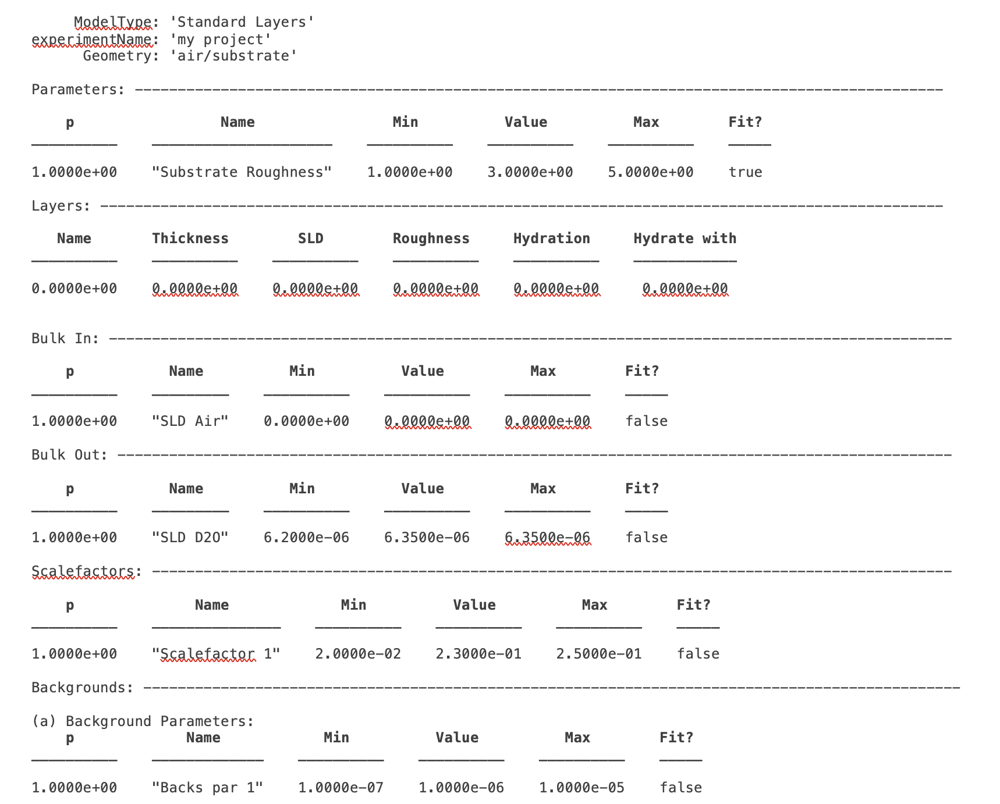
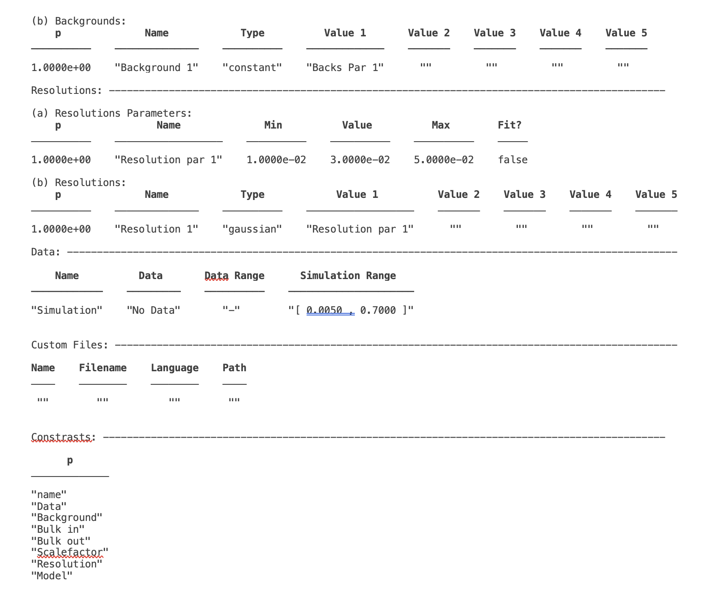

We can see that the class has a number of attributes, defining all we need for our analysis. In our case, we have no parameters or data, and have not defined any contrasts, so this will not do anything useful in RAT. Defining a model is a case of populating the sections in the project class, which we do using the class methods:

.. image:: images/UserManual/Chapter2/projectClassMethods.png
    :alt: Project Class Methods

It's clear from the method names (i.e. ‘addData’) that these methods are going to be useful to us for building our model. In the following sections we will look at each of these methods and see how they can be used to define our reflectivity analysis problem. (There is also a utility which will convert a RasCAL1 model into a projectClass for use in RAT, which we will look at at the end of the chapter. This means that you can use the RasCAL1 GUI to set up your model if you like and then use the speed of RAT to conduct your analysis.)

In terms of the outputs, note that we have called the first output ‘problem’, but we don’t need to do that. The first of the two outputs is another projectClass, but updated with the results of the calculation. So, if we run a fit, the fitted parameters will be updated with the best fit values of our procedure. In giving the output the same name as the input, we’re overwriting our input with best fit values, but if you don’t want to do this, you can give the inputs and outputs different names (e.g. ‘[outProblem,results] = RAT(problem,controls)’ or whatever you like). The second output can also be called whatever you like, and this is a struct containing the simulated reflectivities, SLD’s and so on from whatever procedure you have asked RAT to do:

.. image:: images/UserManual/Chapter2/reflectivitiesStruct.png
    :width: 300
    :alt: Reflectivities Struct

We will look at this struct in more detail in a later chapter. In the next sections, we’ll discuss the methods of the ‘projectClass’, and see how they allow us to build up a model by populating the various sections.

2. Class Methods for the projectClass
=====================================

**(a) Project Defining Methods**
++++++++++++++++++++++++++++++++

The first step is always to create an instance of the projectClass to hold our model. This is always done by assigning projectClass to our variable name (we will mostly use ‘problem’ in this manual, but it can be anything), which always requires a name for our project as an input:

.. code:: MATLAB

    problem = projectClass(‘My Problem’);
    
This creates an instance of projectClass and assigns it to the variable ‘problem’, and gives it the title ‘My Problem’.

The first part of the created problem has two other settable fields: ‘modelType’ and ‘Geometry’.

**Geometry –** This can be set to either ‘air/substrate’ or ‘substrate/liquid’ using the ‘setGeometry’ method. It can take the values of ‘air/substrate’ or ‘substrate/liquid’. 

.. code:: MATLAB

    >> problem.setGeometry('air/substrate');
    >> problem.setGeometry('substrate/liquid');

The effect of this parameter is in the numbering of roughness’s in layer models. In any model for n-layers, there are always n+1 associated interfaces, and hence n+1 roughness parameters required. In RAT, the bulk interface roughness is a protected parameter and always exists (see next section), and this parameter controls where this roughness is placed in the layer stack. So, for two layers defined with thickness, SLD and roughness as [d1 Rho1 R1] and [d2 Rho2 R2], then for the ‘substrate/liquid’ geometry the substrate roughness is placed as the first roughness the beam meets, and the layer roughness’s refer to the interface after the particular layer. For the ‘air/substrate case’, the opposite is true, and the substrate roughness is the last roughness in the stack, with the layer roughness referring to the interface before each layer, as shown.

ModelType – As is the case for RasCAL1, there are three ways of defining models in RAT:-

* Standard Layers – The model is defined in terms of parameters, which are distributed into layers, and subsequently grouped into contrasts. No external functions are needed.
* Custom Layers - Parameters are again defined and grouped into layers, but this time the layer definitions come from a user model script. This then gives complete flexibility of how layers are defined, so allowing models to be written in terms of area per molecule or material density, for example. This custom script controls translating these input parameters into a [d rho r] model. This is probably the most useful operating mode for RasCAL.
* Custom XY-Profile – This modelling mode also relies on a custom model function, but in this case does away with [d rho r] layers completely.  Instead, the custom function uses the parameters to define a continuous SLD profile, which RAT then uses to calculate the reflectivity.

The model type is set using the ‘setModelType’ method:

.. code:: MATLAB

    >> problem.setModelType('standard layers');
    >> problem.setModelType('custom layers');
    >> problem.setModelType('custom XY');

Custom modelling is described in more depth in Chapter 3.

**(b) The ‘Parameters’ Block.**
+++++++++++++++++++++++++++++++

Any model, where it be layers or anything else is always defined by parameters. These appear in the parameters block and are specified by a name, a value, minimum and maximum ranges and a flag defining whether the parameter is fitted or fixed:

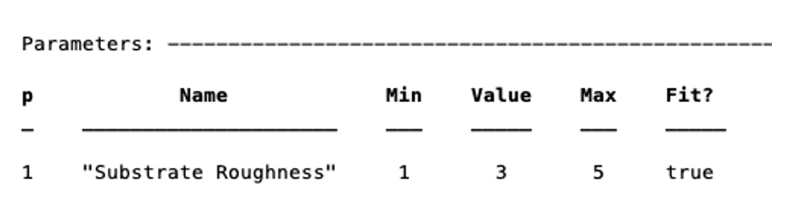

The substrate roughness is a protected parameter in all cases (it defines the Fresnel roughness) and cannot be renamed or deleted. Its values can be set to any numerical values however.

To add a parameter, you can use the ‘addParam’ method, either by just specifying a name, in which case the parameter takes on default values, or by specifying the whole parameter at once (note the Matlab cell array curly brackets syntax for the latter):

.. code:: MATLAB

    >> problem.addParam('My new param');
    >> problem.addParam({'My other new param',10,20,30,false});

To avoid having to make a whole load of ‘addParam’ statements for large projects with many parameters, you can define them at once in a cell array, and add them using the addParamGroup method (again notice the curly brackets syntax – this is a {cell array of {cell arrays}} : 

.. code:: MATLAB

    pGroup = {{'Layer thick' ,10, 20, 30, true};
            {'Layer SLD'   ,1e-6, 3e-6 5e-6, true};
            {'Layer rough' , 5, 7, 10, true}};
        
    >> problem.addParamGroup(pGroup)

The resulting parameters block looks like this:

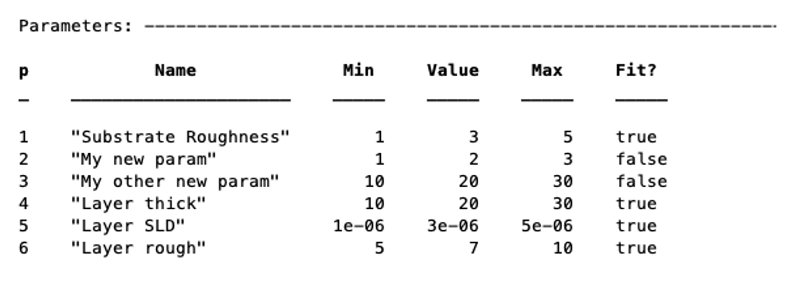

(Note that parameters can’t have duplicate names. Attempting to duplicate a name will throw an error).

To subsequently change the values of the parameters (including names), there are a few methods you can use. For each of the methods, you can refer to the parameter by its name or its number. There are dedicated methods for each of the attributes of the parameters:

.. code:: MATLAB

    problem.setParamName('My new param', 'My changed param');
    problem.setParamConstr(2,0.96,3.62);
    problem.setParamValue(4,20.22);
    problem.setParamFit(‘Layer rough’,false);

.. image:: images/UserManual/Chapter2/resultingParameterBlock2.png
    :width: 600
    :alt: Parameter Block after changing properties

Alternatively, you can set a number of properties of a given parameter at once using name / value pairs.

.. code:: MATLAB

    problem.setParameter(4,'name','thick','min',15,'max',33,'fit',false)

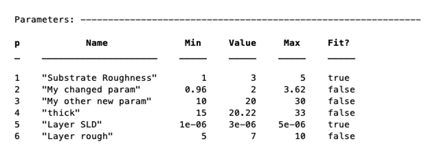

You can remove a parameter from the block using its name or number. Note that if you remove a parameter from the middle of the block, subsequent parameter numbers will change. Also, if you try to remove the substrate roughness you will get an error:

.. code:: MATLAB

    problem.removeParam(4);

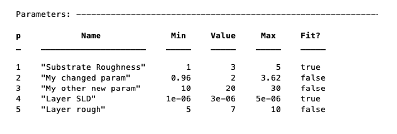

.. image:: images/UserManual/Chapter2/parameterRemoveError.png
    :alt: Error when trying to remove Substrate Roughness

**(c) The Layers Block (Standard Layers models only)**
++++++++++++++++++++++++++++++++++++++++++++++++++++++

For each of the custom models cases, the model building is done using a script (discussed in detail in chapter 3). For standard layers models however, model building is done by grouping the parameters into layers, and then into contrasts (as is the case for RasCAL1). The layers block is not visible when either of the two custom modes is selected. Again, layers are built using methods of the project class. As an example here, we make a new project class, add some parameters, and create some layers.

For this example, we will make two layers representing a deuterated and hydrogenated version of the same layer. So, the layers will share all their parameters except for the SLD.

Start by making a new project, and adding the parameters we will need:

.. code:: MATLAB

    problem = projectClass('Layers Example');
 
    params = {{'Layer Thickness', 10, 20, 30, false};
            {'H SLD', -6e-6, -4e-6, -1e-6, false};
            {'D SLD', 5e-6, 7e-6, 9e-6, true};
            {'Layer rough', 3, 5, 7, true};
            {'Layer hydr', 0, 10, 20, true}};
        
    problem.addParamGroup(params);

A layer is defined in terms of a name, thickness, SLD, roughness and (optional) hydration, along with details of which bulk phase is hydrating the layer. The easiest way to define these is to group the parameters into cell arrays, and then add them to the project as a layers group:

.. code:: MATLAB

    % Make the layers
    H_layer = {'H Layer','Layer Thickness','H SLD','Layer rough','Layer hydr','bulk out'};
    D_layer = {'D Layer','Layer Thickness','D SLD','Layer rough','Layer hydr','bulk out'};
    
    % Add them to the project – as a cell array{}..
    problem.addLayerGroup({H_layer, D_layer});

Our two layers now appear in the Layers block of the project:

.. image:: images/UserManual/Chapter2/twoLayerGroup.png
    :alt: Layers after adding two layers

Note that in RAT, hydration is percent hydration between 0 and 100. It is not necessary to define a hydration at all, and we can also make layers without this parameter:

.. code:: MATLAB

    % Non hydrated layer
    Dry_Layer = {'Dry Layer','Layer Thickness','D SLD','Layer rough'};
    problem.addLayer(Dry_Layer);

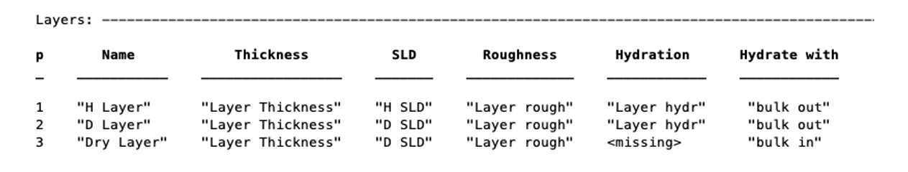

To set the value of an existing layer, you can use the ‘setLayerValue’ method, at the moment using numbers for the layer number, layer parameter and parameter to be changed. So for example:

.. code:: MATLAB

    problem.setLayerValue(1,2,3);

changes parameter 2 (Thickness) of Layer 1 (H Layer) to the 3rd Parameter of the parameter block (H SLD): *(this will soon be changed to allow the use of names rather than numbers if required because numbers are not very intuitive)*

.. image:: images/UserManual/Chapter2/threeLayerGroup2.png
    :alt: Layers after changing thickness

The layers are then used to set up the contrasts as usual with a standard layers model.

**(d) Bulk Phases.**
++++++++++++++++++++

These are treated in the same way as parameters e.g.

.. code:: MATLAB

    problem.addBulkIn({'Silicon',2.0e-6,2.07e-6,2.1e-6,false});
    problem.addBulkOut({'H2O',-0.6e-6,-0.56e-6,-0.5e-6,false});

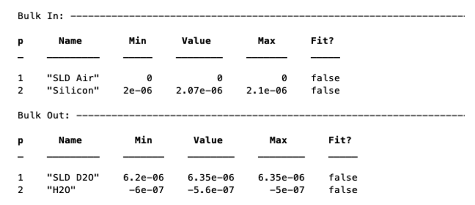

There are no individual methods for each parameter of these, but the values can be modified using name / value pairs as is the case for parameters, using the ‘setBulkIn’ and ‘setBulkOut’ methods e.g.

.. code:: MATLAB

    pproblem.setBulkOut(1,'value',5.9e-6,'fit',true);

**(e) Scalefactors**
++++++++++++++++++++
The scalefactors are another parameters block like the bulk phases. You can add scalefactors with the ‘addScalefactor’ method. Similarly you can set the values with the ‘setScalefactor’ method as with the previous blocks.

.. code:: MATLAB

    problem.addScalefactor({'New Scalefactor',0.9,1.0,1.1,true});
    problem.setScalefactor(1,'value',1.01);

**(f) Backgrounds**
+++++++++++++++++++

**(g) Resolutions**
+++++++++++++++++++

**(h) Data**
++++++++++++

**(i) Putting it all together – defining contrasts**
++++++++++++++++++++++++++++++++++++++++++++++++++++

As is the case for RasCAL1, once we have defined the various aspects of our project i.e. backgrounds, data and so on, we group these together into contrasts to make out fitting project. We can add a contrast using just it’s name, and edit it later, or we can specify which parts of our project we want to add to the contrast using name value pairs:

.. code:: MATLAB

    problem.addContrast('name','D-tail/H-Head/D2O',...
        'background','Background D2O',...
        'resolution','Resolution 1',...
        'scalefactor', 'Scalefactor 1',...
        'nbs', 'SLD D2O',...
        'nba', 'SLD air',...
        'data', 'D-tail / H-head / D2O');

The values which we add must refer to names within the other blocks of the project. So, if you try to add a scalefactor called ‘scalefactor1’ when this name doesn’t exist in the scalefactors block, then an error will result.

Once we have added the contrasts, then we need to set the model, either by adding layers for a ‘standard layers’ project, or a custom model file (we will discuss these in chapter 3). To add either layers or a custom file, we use the ‘setModel’ method. In the case of layers, we give a list of layer names, in order from bulk in to bulk out. So for a monolayer for example, we would specify tails and then heads in a cell array:

.. code:: MATLAB

    problem.setContrastModel(1,{'Deuterated tails','Hydrogenated heads'});

The data can be either a datafile or the simulation object in the data block. Once we have defined our contrasts the appear in the contrasts block at the end of the project when it is displayed.

**(j) A complete example**
++++++++++++++++++++++++++
In Chapter 1, we showed an example of a pre-loaded problem definition class, which we used to analyse data from two contrasts of a lipid monolayer. Now, rather than loading in a pre-defined version of this problem we can use our class methods to build this from scratch, and do the same analysis as we did there, but this time from a script.

To start, we first make an instance of the project class:

.. code:: MATLAB

    problem = projectClass('DSPC monolayers');

Then we need to define the parameters we need. We’ll do this by making a parameters block, and adding these to project class with the ‘addParamGroup’ method:

.. code:: MATLAB

    % Define the parameters:
    Parameters = {
        %       Name                min     val     max      fit? 
        {'Tails Thickness',         10,     20,      30,     true};
        {'Heads Thickness',          3,     11,      16,     true};
        {'Tails Roughness',          2,     5,       9,      true};
        {'Heads Roughness',          2,     5,       9,      true};
        {'Deuterated Tails SLD',    4e-6,   6e-6,    2e-5,   true};
        {'Hydrogenated Tails SLD', -0.6e-6, -0.4e-6, 0,      true};
        {'Deuterated Heads SLD',    1e-6,   3e-6,    8e-6,   true};
        {'Hydrogenated Heads SLD',  0.1e-6, 1.4e-6,  3e-6,   true};
        {'Heads Hydration',         0,      0.3,     0.5,    true};
        };

    problem.addParamGroup(Parameters);

Next we need to group the parameters into our layers. We need four layers in all, representing deuterated and hydrogenated versions of the heads and tails:

.. code:: MATLAB

    H_Heads = {'Hydrogenated Heads',...
                    'Heads Thickness',...
                    'Hydrogenated Heads SLD',...
                    'Heads Roughness',...
                    'Heads Hydration',...
                    'bulk out' };
                
    D_Heads = {'Deuterated Heads',...
                    'Heads Thickness',...
                    'Deuterated Heads SLD',...
                    'Heads Roughness',...
                    'Heads Hydration',...
                    'bulk out' };
                
    D_Tails = {'Deuterated Tails',...
                    'Tails Thickness',...
                    'Deuterated Tails SLD',...
                    'Tails Roughness'};

    H_Tails = {'Hydrogenated Tails',...
                    'Tails Thickness',...
                    'Hydrogenated Tails SLD',...
                    'Tails Roughness'};

Note that the headgroups are hydrated and so share a hydration parameter, whereas the tails are not. We add our layers to the project using the ‘addLayerGroup’ method:

.. code:: MATLAB

    problem.addLayerGroup({H_Heads; D_Heads; H_Tails; D_Tails});

We are using two different subphases: D2O and ACMW. We need a different constant background for each, so we need two ‘backPar’ parameters. There is already one background parameter in the project as a default, so we rename this and add a second one:

.. code:: MATLAB

    problem.setBacksParName(1,'Backs value ACMW'); % Use existing backsPar
    problem.setBacksParValue(1,5.5e-6);
    problem.addBacksPar('Backs Value D2O',1e-8,2.8e-6,1e-5);

Use these parameters to define two constant backgrounds, again using the existing default for one of them:

.. code:: MATLAB

    problem.addBackground('Background D2O','constant','Backs Value D2O');
    problem.setBackgroundValue(1,'name','Background ACMW');
    problem.setBackgroundValue(1,3,'Backs Value ACMW');

We need two subphases for our project. D2O is already in the project as a default, so we only need to add the bulk out for ACMW

.. code:: MATLAB

    problem.addBulkOut({'SLD ACMW' -1e-6,0.0,1e-6,true});

Now we need to add the data. We read in the two files into matlab, and put the data into the data block with appropriate names:

.. code:: MATLAB

    d13ACM = dlmread('d13acmw20.dat');
    d70d2O = dlmread('d70d2o20.dat');
    problem.addData('H-tail / D-head / ACMW', d13ACM);
    problem.addData('D-tail / H-head / D2O', d70d2O);

We have everything we need to now build our contrasts. We have two contrasts in all, and we build them using name / value pairs for all the different parts of the contrasts (i.e. selecting which background and bulk phases etc we need using the names we have given them.

.. code:: MATLAB

    problem.addContrast('name','D-tail/H-Head/D2O',...
        'background','Background D2O',...
        'resolution','Resolution 1',...
        'scalefactor', 'Scalefactor 1',...
        'nbs', 'SLD D2O',...
        'nba', 'SLD air',...
        'data', 'D-tail / H-head / D2O'); 

    problem.addContrast('name','H-tail/D-Head/ACMW',...
        'background','Background ACMW',...
        'resolution','Resolution 1',...
        'scalefactor', 'Scalefactor 1',...
        'nbs', 'SLD ACMW',...
        'nba', 'SLD air',...
        'data', 'H-tail / D-head / ACMW');

To define the models for each contrast, we add the relevant layers as appropriate:

.. code:: MATLAB

    problem.setContrastModel(1,{'Deuterated tails','Hydrogenated heads'});
    problem.setContrastModel(2,{'hydrogenated tails','deuterated heads'});

We need to make sure that we are fitting the relevant backgrounds, scalefactors and bulk phase values:

.. code:: MATLAB

    problem.setBacksPar(1,'fit',true);
    problem.setBacksPar(2,'fit',true);
    problem.setScalefactor(1,'fit',true);
    problem.setBulkOut(1,'fit',true);

Now have a look at our project, to make sure it all looks reasonable

.. code:: MATLAB

    disp(problem)

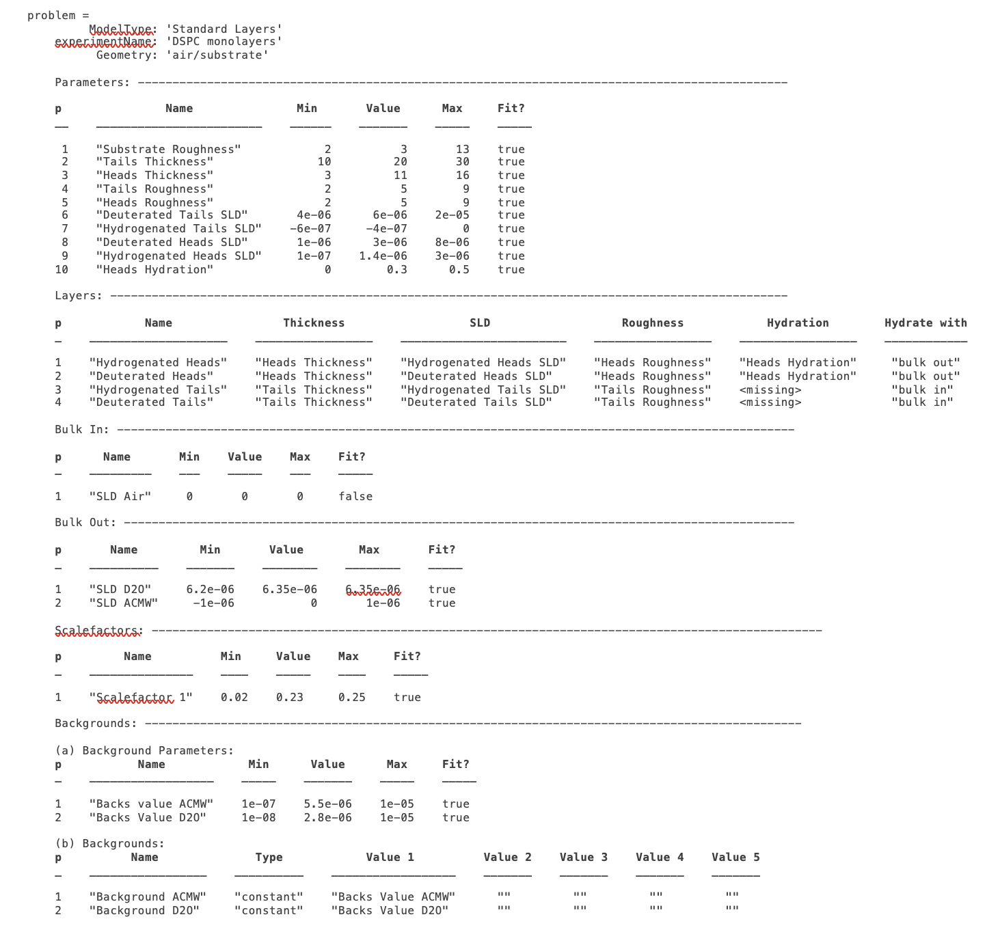
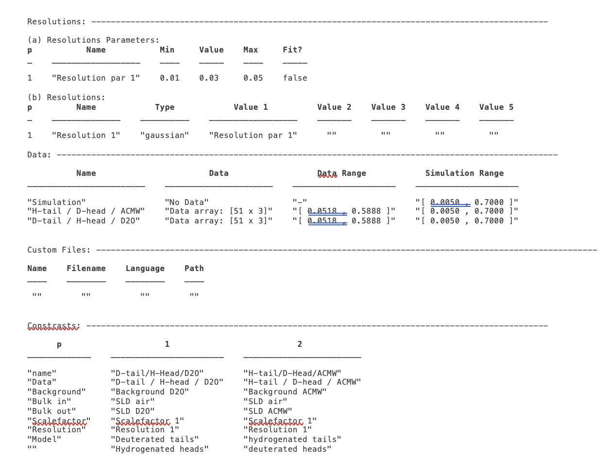

Now we’ll calculate this to check the agreement with the data. We need an instance of the controls class, with the procedure attribute set to ‘calculate’ (the default):

.. code:: MATLAB

    controls = controlsDef();
    controls.parallel = 'points';

    disp(controls)

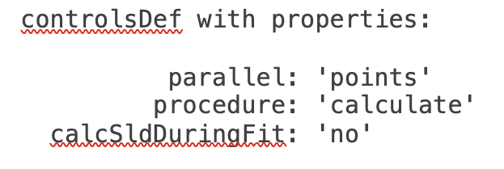

We then send all of this to RAT, and plot the output:

.. code:: MATLAB

    [problem,results] = RAT(problem,controls);

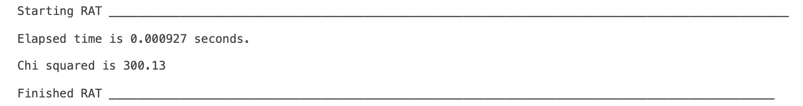

.. code:: MATLAB

    figure(1); clf;
    plotRefSLD(problem,results)

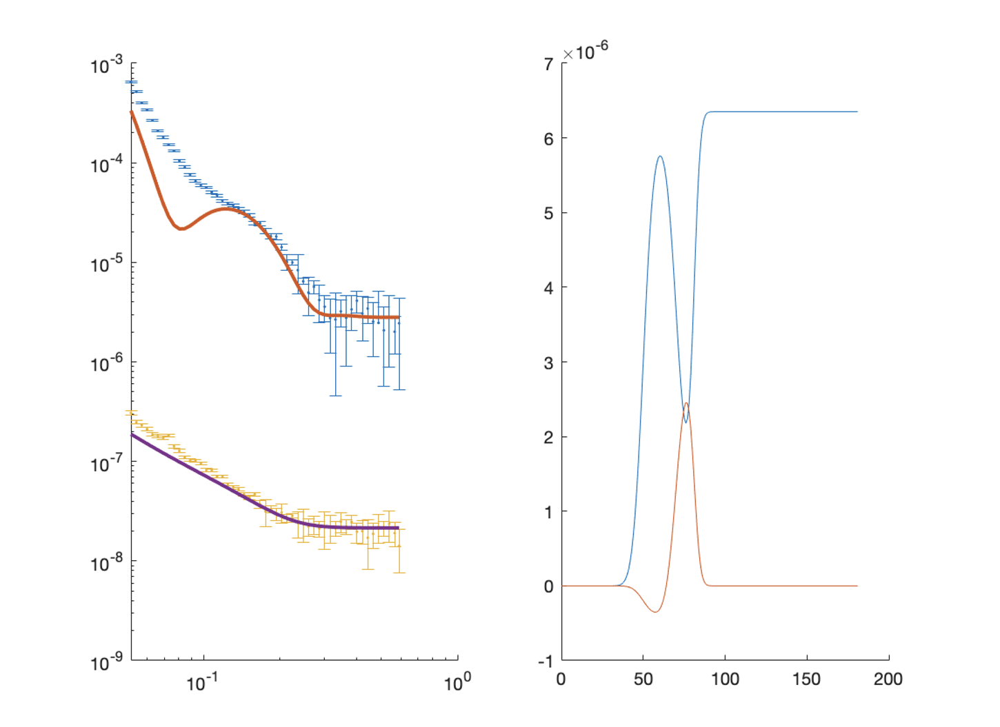

This looks sensible, but clearly our guess values for the parameters are slightly wide of the mark. To do a fit, we change the ‘procedure’ attribute of the controls class to ‘simplex’ (we will look at the controls class in more detail in chapter 4):

.. code:: MATLAB

    controls.procedure = 'simplex'

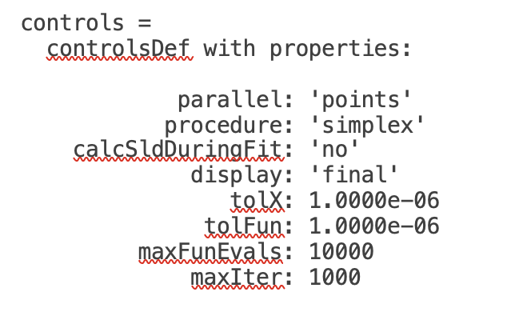

Now when we send our classes to RAT, we will run a simplex fit on our model:

.. code:: MATLAB

    [out,results] = RAT(problem,controls);

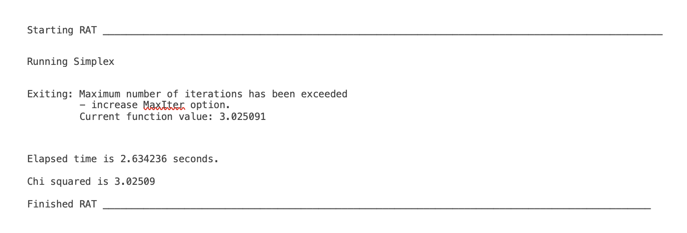

We have two output parameters, ‘out’ and ‘result’. The first is an instance of our project class, but with the parameters values updated to the best fit values, and ‘results’ contains the best fit curves and some other details, which we will look at in more depth in chapter 5.

.. code:: MATLAB

    disp(out)

.. image:: images/UserManual/Chapter2/dispOut1.png
    :alt: Displays Out (first half)
.. image:: images/UserManual/Chapter2/dispOut2.png
    :alt: Displays Out (second half)

.. code:: MATLAB

    disp(results)

.. image:: images/UserManual/Chapter2/dispResults.png
    :width: 300
    :alt: Displays results

We can now plot the results of our fit:

.. code:: MATLAB

    figure; clf
    plotRefSLD(out,results)

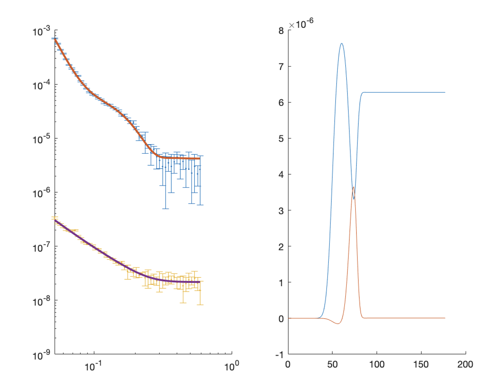

|RasCAL banner|