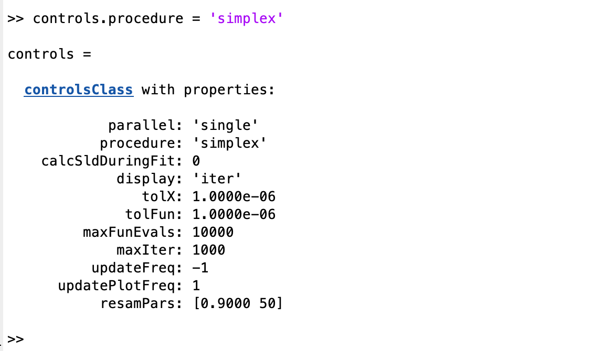

.. _controlsInfo:

A Closer Look at the Controls Class
...................................

We have already seen in previous sections that once the problem has been defined in the projectClass, it is necessary to define a controls
class which, as it's name suggests, tells RAT what we want to do with the project.

Making an instance of the controls class is quite simple:-

.. code:: MATLAB
        
    controls = controlsClass()

This then creates an instance of controlsClass with a number of options defined:

.. image:: images/userManual/controlsDemo/simpleControls.png
    :width: 700
    :alt: Simple controls

We will look at each of thesee in more detail below. Note that the options that are visible depend on
the algorithm selected. So, at the moment the controls are set to 'calculate', which will simply calculate the reflectivity and 
SLD with any associated problem. If we select 'simplex' as the algorithm, a different set of options appears:-

...which allow the user to set things such as tolerance targets and so on. There is a different set of options for each algorithm.
We will no look at each of the available options in turn.

Class Methods for the controlsClass
===================================

**Parallel**
++++++++++++
TODO

**Procedure**
+++++++++++++
TODO

**calcSldDuringFit**
++++++++++++++++++++
TODO

**display**
+++++++++++
TODO

**resamPars**
+++++++++++++
TODO