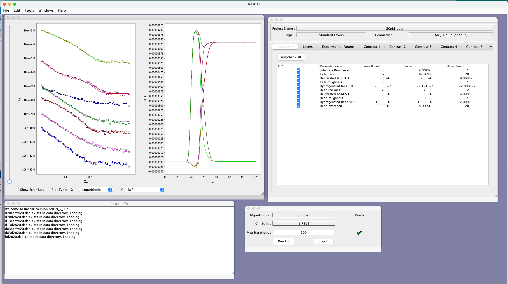

.. _conversionFuncs:

===============================
Convert between RAT and RasCAL1
===============================

Two utilities are provided to convert between RasCAL1 and RAT projects:

* **Convert from R1 to RAT** : You can convert any R! project directly to a projectClass ana analyse using RAT
* **Convert from RAT to R1** : you can also do the reverse and convert a projectClass back to an R1 project if you wish.

Convert R1 to RAT
.................

As an example, we can use the *'monolayer_8_contrasts* demo example shipped with RasCAl1:

To convert this, simply navigate to the project directory, and convert is as follows:

.. code-block:: MATLAB

    problem = r1ToProjectClass('monolayer_8_contrasts.mat')

This produces a *projectClass* containing the R1 project, which can then be analysed as normal:

.. code-block::

    controls = controlsClass();
    controls.procedure = 'de';
    controls.parallel = 'contrasts';
    [problem,results] = RAT(problem,controls);
    plotRefSLD(problem,results);

.. image:: images/misc/r1Converted.png
    :width: 800
    :alt: rascal1 converted

.

Convert RAT to a RasCAL1 Project
................................

It is also possible to do the opposite conversion, and convert any *projectClass* back to an R1 project:

.. code-block::

    projectClassToR1(problem,'saveproject',true,'dirName','testProject','fileName','myConvertedProject')

This will create the usual RasCAL1 project structure in a directory called *testProject*, with a filename called *myConvertedProject.mat*
This can then be loaded into RasCAL1 as normal.

.
