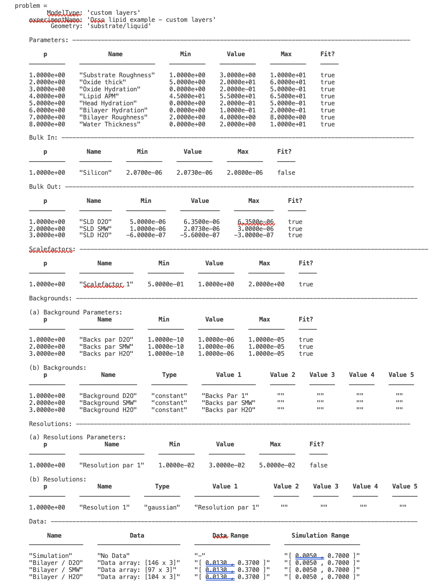
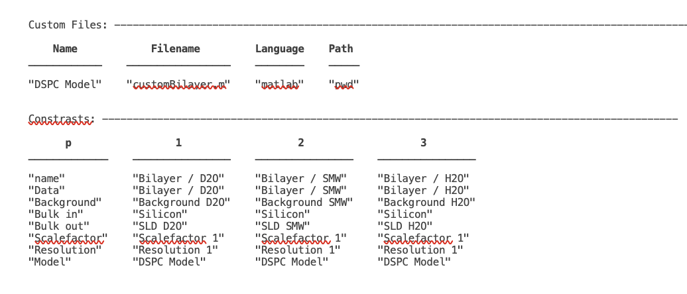
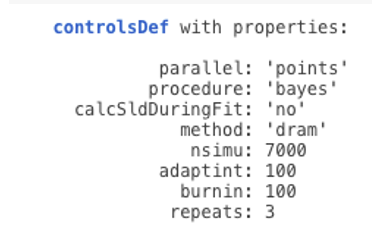
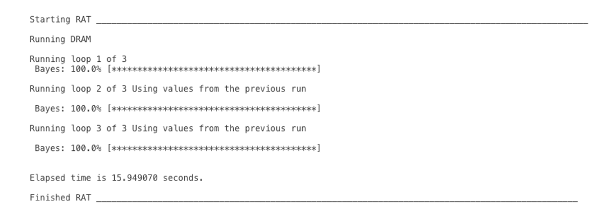
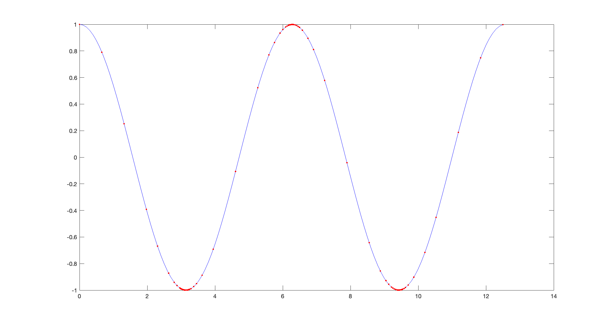

.. _customModelsExamples:

Custom Models
.............

The Standard Layers approach is useful for quickly setting up simple models, but parameterising models in this way is not always the best way of analysing data. For example, in the case of lipids, it is often natural and intuitive to analyse the data in terms of area per lipid rather than in terms of d, :math:`\rho` and roughness. Similarly, for solid state samples thinking in terms of density and composition is often more appropriate than SLD. In common with RasCAL, you can parameterise your model in any way you like, and then rather than building the model in the input class, the model is constructed using a custom model script. This is by far the most powerful method for using RAT for data analysis, as virtually any type of model can be implemented in this way.

Again in common with RasCAL, there are two main options for custom modelling:

* **Custom Layers** - In this method, the parameters are grouped into layers within the script, with the output then defining layers as [d, :math:`\rho`, r] triplets.

* **Custom XY Profile** - In this method the input parameters are used to create a z (in Angstroms) versus SLD curve, from which the reflectivity is calculated. 

Custom Layers Models
====================

The general principle of custom layers models is that we take the defined parameters, and arrange them into an array layers using some code. This is a very powerful
way of defining your model, since you have the freedom to parameterise and define your model however you wish. So rather than beong restricted to just simple [d, rho, sigma] combinations as parameters, you can
define your model in terms of more scientifically useful parameters, such are Area per molecule or density for example. The basic structure of any custom layers script always has the same format:

.. code:: MATLAB

        function [layers,subRough] = myCustomModel(problems,bulkIn,bulkOut,contrast)

        % Some code to define your model

        layers = [d1, rho1, sig1
                  d2, rho2, sig2];

In other words, you get parameters and bulk SLD's in (along with a flag 'contrast' telling your script which contrast to work on), and your code needs to construct the layers array defining the model.
In the next section we'll demonstrate this by making an example to fit a lipi dbilayer sample.

**DSPC Bilayer Example**

In biophysical studies, one of the most common parameters of interest is the area occupied per lipid, be it in a bilayer or a monolayer. Often for lipids, the volume occupied per component is known, which leads to a simple way of calculating the thickness of the head and tail groups. Let the volume of the heads and tails be V\ :sub:`Head` and V\ :sub:`Tail` respectively. Then, for a given Area per Lipid, the thickness of the two layers will be given by :math:`D_\mathrm{Head} = \frac{V_\mathrm{Head}}{APM}` for the headgroup thickness, and :math:`D_\mathrm{Tail} = \frac{V_\mathrm{Tail}}{APM}` for the tail layers. 

In terms of the SLD's, because the volume and composition of each layer is known, then for each, the SLD can be calculated as :math:`\rho = \frac {\sum_{i} n_\mathrm{i} b_\mathrm{i}}{V}` in the usual way. Using literature values for the volumes therefore, rather than parameterising a lipid in terms of thickness, roughness, SLD and coverage of the lipid layers (i.e. head and tail) separately, we can just use a single APM parameter for the whole lipid. In terms of the calculation, we still specify d, :math:`\rho`, rough and coverage on a per layer basis for RAT, but we calculate these in a script for the bilayer from the APM and known composition and volume. This not only gives us the ability to fit our data using more realistic biophysical parameters (in our case APM), but also reduces the number of parameters (dimensions) of our model.

The figure shows the system we are measuring. We have a single, hydrogenated DSPC bilayer supported on a silicon surface. The silicon is, as always, coated with an oxide layer. The bilayer may or may not be complete (i.e. partially hydrated) so we will need hydration parameters, and there is the possibility of a thin water layer between the bilayer and the substrate. We also need some roughness parameters, both for the substrate and the bilayer itself. We will build a custom model for this and use it to analyse the bilayer data at three contrasts.

Looking at our system, we can see that we are going to need 8 parameters in total:

.. list-table::
   
   * - **Parameters**
     - **Description**
   * - Substrate Roughness
     - This roughness is used for the silicon and oxide layer
   * - Oxide Thickness
     - Thickness of the oxide layer
   * - Oxide hydration
     - Required to deal with incomplete coverage of the oxide, which is common
   * - Lipid APM
     - Area per molecule of the DSPC bilayer, which is the same for both heads and tails.
   * - Head Hydration
     - The hydration level of the bilayer headgroups
   * - Bilayer Hydration
     - Overall coverage parameter for the DSPC bilayer
   * - Bilayer roughness
     - Roughness parameter for the bilayer, which we assume is the same for heads and tails.
   * - Water Thickness
     - Thickness of a possible hydrating layer between the membrane and the oxide.

These are the parameters that we will define in the parameters block.

We start in the usual way by making in instance of the **projectClass**, but this time we change the project type to *custom layers*, and also change the geometry to *solid/liquid*:

.. code:: MATLAB

    problem = projectClass('Orso lipid example - custom layers');
    problem.setModelType('custom layers');
    problem.setGeometry('Substrate/liquid');

If you look at the class, you will see that the *layers* block is no longer visible. We aren't going to need this for *custom layers*. Instead, we need a custom script, which takes our inputs and converts this in to a list of [d, :math:`\rho`, r] layers.

First, we add our seven parameters (remember that Substrate Roughness is always there as the first parameter), which we do as before using the **addParamGroup** method:

.. code:: MATLAB

    Parameters = {
            %  Name                min          val         max     fit? 
            {'Oxide thick',         5,          20,         60,     true   };
            {'Oxide Hydration'      0,          0.2,        0.5,    true   };
            {'Lipid APM'            45          55          65      true   };
            {'Head Hydration'       0           0.2         0.5     true   };
            {'Bilayer Hydration'    0           0.1         0.2     true   };
            {'Bilayer Roughness'    2           4           8       true   };
            {'Water Thickness'      0           2           10      true   };
            };
        
    problem.addParamGroup(Parameters);

The custom file that we are going to use is called *customBilayer.m*. This is a MATLAB (or Octave - both are identical) function, which takes our input parameters and translates them into a list of layers. To add the file, we use the **addCustomFile** method:

.. code:: MATLAB

    % name filename language path
    problem.addCustomFile('DSPC Model', 'customBilayer.m' ,'matlab',  pwd);

The custom files are in exactly the same format at those in RasCAL. To add it to our project in RAT we always need to specify four things:

* **Name** - This is any name we choose for this custom file. This is the name we use later to add this to the contrasts.

* **Filename** - This is the actual filename of the custom file, including its file extension (MATLAB and octave are both '.m')

* **Language** - The language which we are going to use to process the file. We are choosing MATLAB, which means that the native MATLAB interpreter (i.e. the one we are using to call the project in this example) will be used to process the script. There is further discussion on the languages available and their merits in chapter 6.

* **Path** - The path to our custom file. In this case it's in the same directory as the model script (pwd).

At this point it's useful to look at *customBilayer.m* and then go through it section by section:

.. code:: MATLAB

    function [output,sub_rough] = customBilayer(params,bulk_in,bulk_out,contrast)
    %CUSTOMBILAYER  RASCAL Custom Layer Model File.
    %
    %
    % This file accepts 3 vectors containing the values for
    % Params, bulk in and bulk out
    % The final parameter is an index of the contrast being calculated
    % The m-file should output a matrix of layer values, in the form..
    % Output = [thick 1, SLD 1, Rough 1, Percent Hydration 1, Hydrate how 1
    %           ....
    %           thick n, SLD n, Rough n, Percent Hydration n, Hydration how n]
    % The "hydrate how" parameter decides if the layer is hydrated with
    % Bulk out or Bulk in phases. Set to 1 for Bulk out, zero for Bulk in.
    % Alternatively, leave out hydration and just return..
    % Output = [thick 1, SLD 1, Rough 1,
    %           ....
    %           thick n, SLD n, Rough n] };
    % The second output parameter should be the substrate roughness

    sub_rough = params(1);
    oxide_thick = params(2);
    oxide_hydration = params(3);
    lipidAPM = params(4);
    headHydration = params(5);
    bilayerHydration = params(6);
    bilayerRough = params(7);
    waterThick = params(8);

    % We have a constant SLD for the oxide
    oxide_SLD = 3.41e-6;

    % Now make the lipid layers..
    % Use known lipid volume and compositions
    % to make the layers.

    % define all the neutron b's.
    bc = 0.6646e-4;     %Carbon
    bo = 0.5843e-4;     %Oxygen
    bh = -0.3739e-4;	%Hydrogen
    bp = 0.513e-4;      %Phosphorus
    bn = 0.936e-4;      %Nitrogen
    bd = 0.6671e-4;     %Deuterium

    % Now make the lipid groups..
    COO = (4*bo) + (2*bc);
    GLYC = (3*bc) + (5*bh);
    CH3 = (2*bc) + (6*bh);             
    PO4 = (1*bp) + (4*bo);
    CH2 = (1*bc) + (2*bh);
    CHOL = (5*bc) + (12*bh) + (1*bn);

    % Group these into heads and tails:
    Head = CHOL + PO4 + GLYC + COO;
    Tails = (34*CH2) + (2*CH3);

    % We need volumes for each.
    % Use literature values:
    vHead = 319;
    vTail = 782;

    % we use the volumes to calculate the SLD's
    SLDhead = Head / vHead;
    SLDtail = Tails / vTail;

    % We calculate the layer thickness' from
    % the volumes and the APM...
    headThick = vHead / lipidAPM;
    tailThick = vTail / lipidAPM;

    % Manually deal with hydration for layers in
    % this example.
    oxSLD = (oxide_hydration * bulk_out(contrast)) + ((1 - oxide_hydration) * oxide_SLD);
    headSLD = (headHydration * bulk_out(contrast)) + ((1 - headHydration) * SLDhead);
    tailSLD = (bilayerHydration * bulk_out(contrast)) + ((1 - bilayerHydration) * SLDtail);

    % Make the layers
    oxide = [oxide_thick oxSLD sub_rough];
    water = [waterThick bulk_out(contrast) bilayerRough];
    head = [headThick headSLD bilayerRough];
    tail = [tailThick tailSLD bilayerRough];

    % Group the layers to make the output
    output = [oxide ; water ; head ; tail ; tail ; head];

    end

The standard format for a custom layers file always has 4 inputs:

.. code:: MATLAB

    (params, bulk_in, bulk_out, contrast)

Params is a list of parameter values for the layers, which appear in the same order that we defined them in our parameters block, so is always a [1 x nParams] array of doubles. It's useful to split this array into its individual parameters at the start of the custom file, although you don't have to do this:

.. code:: MATLAB

    sub_rough = params(1);
    oxide_thick = params(2);
    oxide_hydration = params(3);
    lipidAPM = params(4);
    headHydration = params(5);
    bilayerHydration = params(6);
    bilayerRough = params(7);
    waterThick = params(8);

The next two inputs are arrays of all the bulk in and bulk out values for all the contrasts, and 'contrast' is an integer telling the script which contrast it should calculate. The reason for passing the values of the bulk phases is that these are needed to calculate the SLD's of the layers if they are hydrated. So, to calculate the SLD of the Oxide layer, we take the known SLD for Silicon dioxide, and then use the oxide coverage parameter to calculate the effective SLD of the oxide. Because we define our coverage as a parameter between 0 and 1, where 1 is full coverage and 0 is fully hydrated, we can work out this SLD as a simple ratio between oxide SLD and water SLD

:math:`SLD_\mathrm{Hydrated layer} = (Hydration * SLD_\mathrm{water}) + ((1-Hydration)*SLD_\mathrm{layer})`

The input parameter *bulk_in* is an array which is a list of the current SLD's for all the contrasts, so the current SLD of the water (which may be being fitted) is given by bulk_out(contrast). Therefore, the effective SLD of the oxide layer at a particular contrast is given by:

.. code:: MATLAB

    oxide_SLD = 3.41e-6;
    oxSLD = (oxide_hydration * bulk_out(contrast)) + ((1 - oxide_hydration) * oxide_SLD);

To work out the thickness of the lipid layers, we use literature values for the head and tails volumes, and divide these by the APM (parameter 4 in our list):

.. code:: MATLAB

    % We need volumes for each.
    % Use literature values:
    vHead = 319;
    vTail = 782;

    % We calculate the layer thickness' from
    % the volumes and the APM...
    headThick = vHead / lipidAPM;
    tailThick = vTail / lipidAPM;

For the SLD's, we again make use of these volumes, but we need to work out the sum of the scattering lengths from the layers compositions:

.. code:: MATLAB

    % define all the neutron b's.
    bc = 0.6646e-4;     %Carbon
    bo = 0.5843e-4;     %Oxygen
    bh = -0.3739e-4;    %Hydrogen
    bp = 0.513e-4;      %Phosphorus
    bn = 0.936e-4;      %Nitrogen
    bd = 0.6671e-4;     %Deuterium

    % Now make the lipid groups..
    COO = (4*bo) + (2*bc);
    GLYC = (3*bc) + (5*bh);
    CH3 = (2*bc) + (6*bh);             
    PO4 = (1*bp) + (4*bo);
    CH2 = (1*bc) + (2*bh);
    CHOL = (5*bc) + (12*bh) + (1*bn);

    % Group these into heads and tails:
    Head = CHOL + PO4 + GLYC + COO;
    Tails = (34*CH2) + (2*CH3);

    % we use the volumes to calculate the SLD's
    SLDhead = Head / vHead;
    SLDtail = Tails / vTail;

We also do the coverage correction as we did for the Oxide:

.. code:: MATLAB

    headSLD = (headHydration * bulk_out(contrast)) + ((1 - headHydration) * SLDhead);
    tailSLD = (bilayerHydration * bulk_out(contrast)) + ((1 - bilayerHydration) * SLDtail);

This gives us all the parameters we need to define our layers. In other words, we have a thickness, SLD and roughness for each:

.. code:: MATLAB

    % Make the layers
    oxide = [oxide_thick oxSLD sub_rough];
    water = [waterThick bulk_out(contrast) bilayerRough];
    head = [headThick headSLD bilayerRough];
    tail = [tailThick tailSLD bilayerRough];

We then put these together to make our stack:

.. code:: MATLAB

    output = [oxide; water; head; tail; tail; head];

Note the use of semicolons. In Matlab / Octave syntax, this concatenates arrays columnwise. So if you take an array a = [a1, a2, a3], and another b = [b1, b2, b3], then [a ; b] produces an array that looks like this:

.. math::

   \begin{bmatrix} a_\mathrm{1} & a_\mathrm{2} & a_\mathrm{3} \\ b_\mathrm{1} & b_\mathrm{2} & b_\mathrm{3} \end{bmatrix}

In other words, the entire purpose of our custom layer file is to take our parameters in a scientifically useful form (e.g. Area per Lipid in our case), and to translate these into a list of thick, SLD, rough layers for the whole interface. You have complete freedom in how you do this, which means that you can make any kind of layer model you can think of using a custom layers file, including layers that are mixtures of adjoining layers and so on. As long as you can describe your system as layers with an error function (i.e. Nevot and Croce) roughness you can describe them using custom layer modelling.

The rest of the custom model is defined in the same way as the standard layers model, using the same class methods as in the last chapter. So, since we want to analyse three contrasts simultaneously, we need the following:

.. code:: MATLAB

   % Change bulk in from air to silicon....
    problem.setBulkIn(1,'name','Silicon','min',2.07e-6,'value',2.073e-6,'max',2.08e-6,'fit',false);

    % Add two more values for bulk out....
    problem.addBulkOut('SLD SMW',1e-6,2.073e-6,3e-6,true);
    problem.addBulkOut('SLD H2O',-0.6e-6,-0.56e-6,-0.3e-6,true);

    problem.setBulkOut(1,'fit',true,'min',5e-6);

    % Read in the datafiles
    D2O_data = dlmread('c_PLP0016596.dat');
    SMW_data = dlmread('c_PLP0016601.dat');
    H2O_data = dlmread('c_PLP0016607.dat');

    % Add the data to the project
    problem.addData('Bilayer / D2O', D2O_data(:,1:3));
    problem.addData('Bilayer / SMW', SMW_data(:,1:3));
    problem.addData('Bilayer / H2O', H2O_data(:,1:3));

    problem.setData(2,'dataRange',[0.013 0.37]);
    problem.setData(3,'dataRange',[0.013 0.37]);
    problem.setData(4,'dataRange',[0.013 0.37]);

    % Change the name of the existing parameters to refer to D2O
    problem.setBackgroundParam(1,'name','Backs par D2O','fit',true,'min',1e-10,'max',1e-5,'val',1e-6);

    % Add two new backs parameters for the other two..
    problem.addBackgroundParam('Backs par SMW',1e-10,1e-6,1e-5,true);
    problem.addBackgroundParam('Backs par H2O',1e-10,1e-6,1e-5,true);

    % And add the two new constant backgrounds..
    problem.addBackground('Background SMW','constant','Backs par SMW');
    problem.addBackground('Background H2O','constant','Backs par H2O');

    % And edit the other one....
    problem.setBackground(1,'name','Background D2O', 'value1','Backs par D2O');

    % Set the scalefactor...
    problem.setScalefactor(1,'Value',1,'min',0.5,'max',2,'fit',true);

    % Make the contrasts...
    problem.addContrast('name','Bilayer / D2O',...
                        'background','Background D2O',...
                        'resolution','Resolution 1',...
                        'scalefactor', 'Scalefactor 1',...
                        'nbs', 'SLD D2O',...        % This is bulk out ('Nb Subs')
                        'nba', 'Silicon',...        % This is bulk in ('Nb Air')
                        'data', 'Bilayer / D2O');

    % SMW contrast..
    problem.addContrast('name','Bilayer / SMW',...
                        'background','Background SMW',...
                        'resolution','Resolution 1',...
                        'scalefactor', 'Scalefactor 1',...
                        'nbs', 'SLD SMW',...        % This is bulk out
                        'nba', 'Silicon',...        % This is bulk in
                        'data', 'Bilayer / SMW');

    % SMW contrast..
    problem.addContrast('name','Bilayer / H2O',...
                        'background','Background H2O',...
                        'resolution','Resolution 1',...
                        'scalefactor', 'Scalefactor 1',...
                        'nbs', 'SLD H2O',...        % This is bulk out
                        'nba', 'Silicon',...        % This is bulk in
                        'data', 'Bilayer / H2O');

Finally, we add the model, again using the **setContrastModel** method, but in this case we give the name of our custom model from the custom files block (rather than a list of layers):

.. code:: MATLAB

    problem.setContrastModel(1,'DSPC Model');
    problem.setContrastModel(2,'DSPC Model');
    problem.setContrastModel(3,'DSPC Model');

Our final projectClass looks like this:

.. code:: MATLAB

    disp(problem)

To run this, we make a controls block as before, and pass this to RAT. This time we will do a DREAM analysis (we will discuss the controls block and available algorithms in more detail in Chapter 4).

.. code:: MATLAB

    controls = controlsClass();
    controls.parallel = 'contrasts';

    disp(controls)

.. code:: MATLAB

    [problem,results] = RAT(problem,controls);

Custom XY Profile Models
========================

Although many systems can be well described by layers, sometimes these are not the most appropriate. So for example, we may want to incorporate SLD profiles from molecular simulations, or use interfaces that are not error functions. In these cases, a second type of custom model can be used, where instead of the custom model function outputting a list of layers, it builds a continuous SLD profile, which is then automatically microsliced by RAT to calculate the reflectivity. This gives a high degree of flexibility for the type of model that can be generated.
The inputs into customXY are the same as for Custom Layers, but the output is now always an [n x 2] array defining a continuous SLD:

.. code:: MATLAB

        function [SLD,subRough] = myCustomXY(problems,bulkIn,bulkOut,contrast)

        % Some code to define your model

        SLD = [X1, Y1
               X2, Y2
                  ...
               Xn  Yn];

In other words, as the name suggests, a customXY model outputs a continuous SLD profile rather than a list of layers. THis makes it easy to incorporate information
such as protein volume fractions from simulations, or to make interfaces that are not describes as error functions, for example.

As an example, we will do a simulation of a metal layer on Silicon, with a surface roughness that is governed by a tanh function rather than an error function.

Because we are making the full SLD profile, if we want layers in it then we have to define our own. This is quite easy since a layer is just two error functions back-to-back.
I the following code snippet we'll make an example of a simple layer....

.. code:: MATLAB

        % Make a range for our simulation....
        z = 0:100;

        % Define fome layer patameters....
        height = 1;
        roughLeft = 3;
        roughRight = 8;
        centre = 50;
        width = 50;

        r = centre + (width/2);
        l = centre - (width/2);

        a = (z-l)./((2^0.5) * roughLeft);
        b = (z-r)./((2^0.5) * roughRight);

        f = (height/2)*(erf(a)-erf(b));

        figure(1); clf
        plot(z,f);
        axis([0 100 0 1.5]);

.. image:: images/userManual/chapter3/simpleLayer.png

A simple stack of such layers covers any regions of your model that are intended to be simple layers. For our tanh layer, we will do a similar thing, but replace one side with a tanh distribution...

.. code:: MATLAB

        function [SLD,subRough] = tanhLayer(params,bulkIn,bulkOut,contrast)

        % Flag to control whether we do a debug plot....
        debugPlot = true;

        % Make the z array.....
        z = 0:150;

        % Split up the parameters...
        subRough = params(1);
        layerThick = params(2);
        layerSLD = params(3);
        layerRough = params(4);

        % Make a layer for the silicon..
        width = 50;
        [silicon,siSurface] = erfLayer(z,width,0,subRough,subRough,2.073e-6);

        % Make the tanh layer....
        centre = siSurface + layerThick/2;
        layer = tanh(z,layerThick,centre,subRough,layerRough,layerSLD);

        % Our total SLD is just the sum of the functions representing our model,
        % but we flip it so that the substrate is on the fight side of the model
        silicon = fliplr(silicon);
        layer = fliplr(layer);
        SLD = silicon + layer;

        % Do a debug plot...
        if debugPlot
        figure(1); clf;
        plot(z,silicon);
        hold on
        plot(z,layer);
        plot(z,SLD,'k-','LineWidth',2.0);

        end

        end

        function [f,layerSurface] = erfLayer(x,xw,xcen,s1,s2,h);
        % Produces a step function convoluted with differnt error functions
        % on each side.
        % Convstep (x,xw,xcen,s1,s2,h)
        %       x = vector of x values
        %      xw = Width of step function
        %    xcen = Centre point of step function
        %       s1 = Roughness parameter of left side
        %       s2 = Roughness parameter of right side
        %       h = Height of step function.

        r = xcen + (xw/2);
        l = xcen - (xw/2);

        a = (x-l)./((2^0.5)*s1);
        b = (x-r)./((2^0.5)*s2);

        f = (h/2)*(erf(a)-erf(b));

        layerSurface = r;

        end

        function [f,layerSurface] = tanh(x,xw,xcen,s1,s2,h);

        % tanhlayer (x,xw,xcen,s1,s2,h)
        %       x = vector of x values
        %      xw = Width of step function
        %    xcen = Centre point of step function
        %       s1 = Roughness parameter of left side
        %       s2 = Roughness parameter of right side
        %       h = Height of step function.

        r = xcen + (xw/2);
        l = xcen - (xw/2);

        a = (x-l)./((2^0.5)*s1);
        b = (x-r)./((2^0.5)*s2);

        f = (h/2)*(erf(a)-erf(b));

        layerSurface = r;

        end

.. note::

    Since we want this to be an air-liquid sample, we flip the model once we have created it to leave the substrate on the right of the plot. Broadly speaking,
    you can imagine the neutrons travelling left to right, with the lsft side of the plot being Bulk In, and Bulk Out on the right..

To run our simulation, we make a RAT model as normal:

.. code:: MATLAB

    problem = createProject(model = 'custom XY', geometry = 'Air/substrate');

    % Add the parameters
    parameters = {{'layerThick',10,   50,   70  }
                  {'layerSLD',  2e-6, 3e-6, 4e-6}
                  {'layerRough',  5,  8,    12  }
                  };

    problem.addParameterGroup(parameters);

    % Change the bulk-out to Si....
    problem.setBulkOut(1,'name','SLD Silicon','value',2.073e-6,'fit',false);

    % Add the custom model....
    problem.addCustomFile('LayerMod','tanhLayer.m','matlab',pwd);

    % Make the contrast...
    problem.addContrast('name',         'Simple Layer',...
                    'bulkIn',       'SLD Air',...
                    'bulkOut',      'SLD Silicon',...
                    'resolution',   'Resolution 1',...
                    'scalefactor',  'Scalefactor 1',...
                    'background',   'Background 1',...
                    'Data',         'Simulation');

    problem.setContrastModel(1,'LayerMod');

..run it and plot the results...

.. code:: MATLAB

    [problem,resuts] = RAT(problem,controls);

    figure(1); clf
    plotRefSLD(problem,results);

