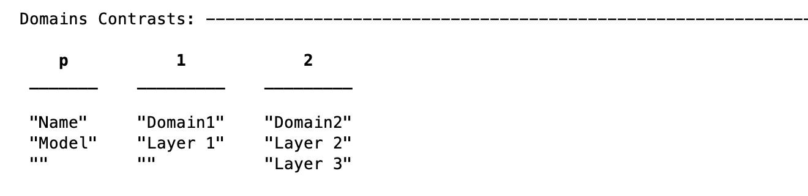
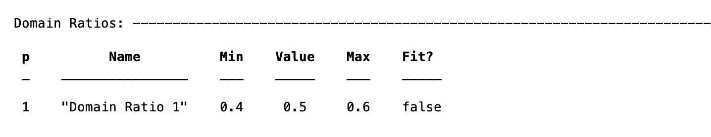
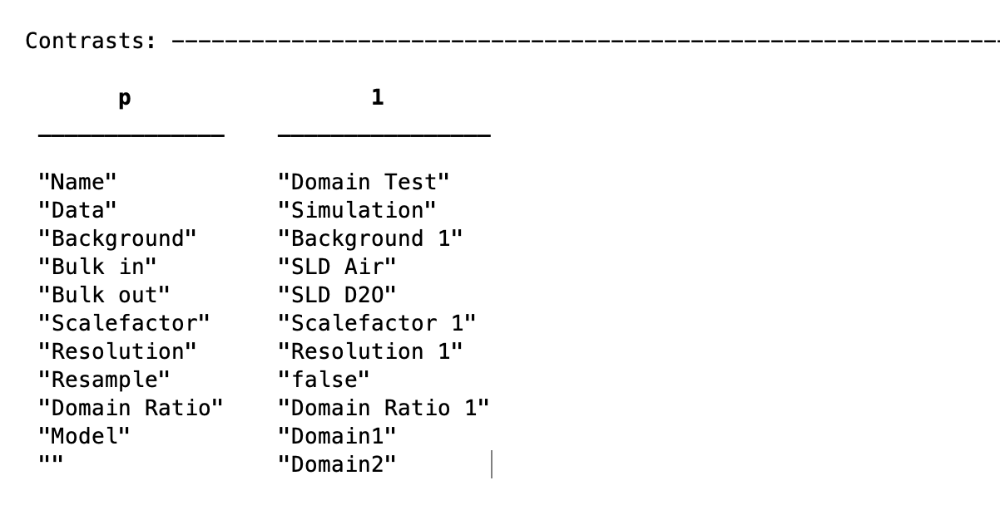

.. _domainsStanlay:

Standard Layers Domains
.......................

.. note::
    See the */examples/domains/standardLayers/ folder for an example of standard layers with domains.

In order to use domains, we create a project of the correct type....

.. code:: MATLAB

    problem = createProject(calcType="domains")

The principle of setting up these calculations relies on firstly grouping the layers into domains, then grouping the defined domains intro contrasts, according to a 'domain ratio' parameter:

.. image:: images/userManual/calcTypes/domainGraph.png
    :width: 800

The example (in the examples folder), we define the layers as for conventional Standard Layers projects:

.. code:: MATLAB

    Layer1 = {'Layer 1',...         % Name of the layer
        'L1 thick',...              % Layer thickness
        'L1 SLD',...                % Layer SLD
        'L1 Rough',...              % Layer roughness
        'L1 Hydr',...               % hydration (percent)
        'bulk out' };

    Layer2 = {'Layer 2',...         % Name of the layer
        'L2 thick',...              % Layer thickness
        'L2 SLD',...                % Layer SLD
        'L2 Rough',...              % Layer roughness
        'L2 Hydr',...               % hydration (percent)
        'bulk out' };

    Layer3 = {'Layer 3',...         % Name of the layer
        'L2 thick',...              % Layer thickness
        'L2 SLD',...                % Layer SLD
        'L2 Rough',...              % Layer roughness
        'L2 Hydr',...               % hydration (percent)
        'bulk out' };

    problem.addLayerGroup({Layer1, Layer2, Layer3});

.. image:: images/userManual/calcTypes/domainLayersTable.png
    :width: 800

From this point, the model diverges from the usual Standard Layers case, in that these are grouped into 'domain contrasts', which appear in an additional table in the
display projectClass. Domains contrasts consist of only layers, with no bulk phases etc..

It is then these that are grouped into the final contrasts model. For each contrast, there must be two (*and only two*) domain contrasts. In addition, each contrast requires a
Domain Ratio parameter. This is a fittable parameter between 0 and 1, that appears in the Domain Ratio table:

leading to the final contrast structure of two domains, and one domain ratio:

.. note:: For domain ratio, a ratio of 0 means 100% Domain 1, whilst conversely a ratio of 1 means 100% Domain 2.

