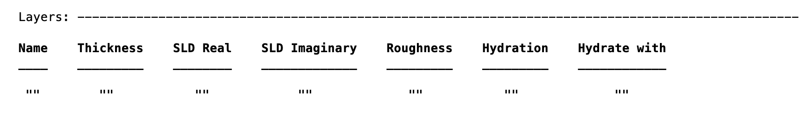

.. _imaginary:

Adding the Imaginary Refractive Index
.....................................

In contrast to RasCAL1, RAT allows the inclusion of the imaginary part of the refractive index to the project. The exact method of doing this varies according to the calculation type,
but at the project top-level, the method of enabling it is always the same. If the project is called 'problem', then:

.. code:: MATLAB

    problem.absorption = true;

How this is then handled depends on the calculation type.

**Standard Layers Models**
++++++++++++++++++++++++++
The imaginary refractive index appears as a new column in the 'Layers' block..

Then, the value of this column are set (from the Parameters block) in the same way as all the other cells in the table.

**Custom Models**
++++++++++++++++++++++++
For custom models, an extra column is also required in the output from the custom function.

So, for example, in the */examples/miscellaneous/absorption* folder, there is a Custom Layers example including absorption. In this example (a bilayer on a gold surface)
an imaginary SLD is required for the metal layers:

.. code:: MATLAB

    GOLD = [goldThick goldSLD goldISLD goldRough];
    alloyUp = [alloyThick alloySLDUp alloyISLDUp alloyRough];
    alloyDown = [alloyThick alloySLDDown alloyISLDDown alloyRough];

but there is no imaginary component expected for the organic layers (but the extra column is still necessary).

.. code:: MATLAB

    BILTAILS = [thickTail sldTail 0 bilayerRough];
    BILHEAD = [thickHead sldHead 0 bilayerRough];
    BILME = [thickMe sldMe 0 bilayerRough];

For custom XY models, it is necessary to construct a profile which represents the imaginary SLD across the sample, and this then appears as am extra column in the output:

.. code:: MATLAB

    output = [X1    SLD1    SLD_im_1
              X2    SLD2    SLD_im_2
                    ...
              Xn    SLDn    SLD_im_n] ;

