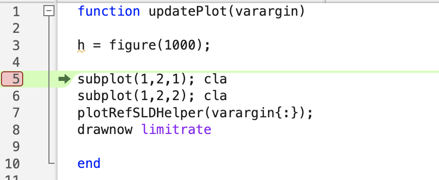
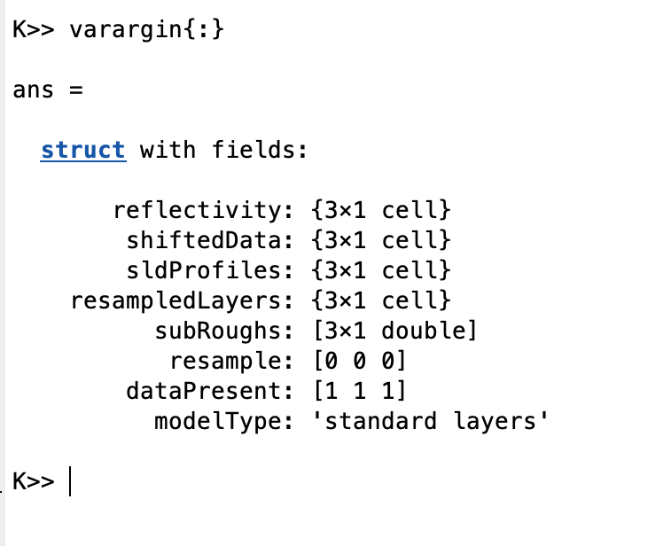
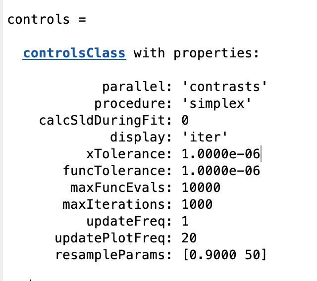

.. _livePlot:

Events and Live Updating Plots
..............................

Sometimes it is useful to be able to monitor the progress / success of a fit in real time for long simulations. For Simplex and DE fits, RAT sends out 'events', which send out data concerning the
reflectivity, SLD's and so on as the fit progresses. By writing functions that 'listen' to these events, you can use this information to build various kinds of graphical updates to suit your needs.
In this section, we'll use this capability to build a live, updating plot of reflectivity and SLD, similar to that of the main RasCAL GUI.

.. note::
        The code in this section already exists in the repo (utilities / plotting), and you can activate the full updating plot at any time by just typing 'useUpdatePlot()' at the Matlab command window. But we detail it here to illustrate how to interact with events.

**Registering Listeners**

On the Matlab side, the interaction with RAT event is via the 'eventManager' class. To register a listener, we use the 'register' method to associate a function with the event.

.. code-block:: MATLAB

        eventManager.register(eventTypes.Plot, 'updatePlot');

In this line, we've done two things: we've registered a 'listener' for 'Plot' events, and defined the function 'updatePlot' as the function that runs when the event is triggered (known as a 'handler')
We need to define the handler function:

.. code-block:: MATLAB

        function updatePlot(varargin)

            h = figure(1000);                   % Select / open the figure

            subplot(1,2,1); cla                 % Reflectivity plot panel
            subplot(1,2,2); cla                 % SLD plot panel
            plotRefSLDHelper(varargin{:});      % Use the standard RAT reflectivity plot
            drawnow limitrate                   % Make sure it updates

        end

We can put a breakpoint in our function to examine the contents of varargin

We see that it's a struct containing everything needed to make our custom plot:

In other words, RAT has packaged the current state of the reflectivity and SLD's, along with a number of other items that you can use to make a plot however you like.
For these purposes, we just make use of the existing RAT plot routine to make our plot. The result is the updating plot routine bundled with RAT.

**Frequency of events**

To control how often the event is triggered, we set the 'updatePlotFreq' parameter in the controls block, which defaults to 20:

.. note::
    If you set the plot frequency too low (i.e. make the plot update too often), this will slow your fit as Matlab takes time out of the analysis to update the figure.
    Updating every 20 iterations is a reasonable compromise between speed and utility.

