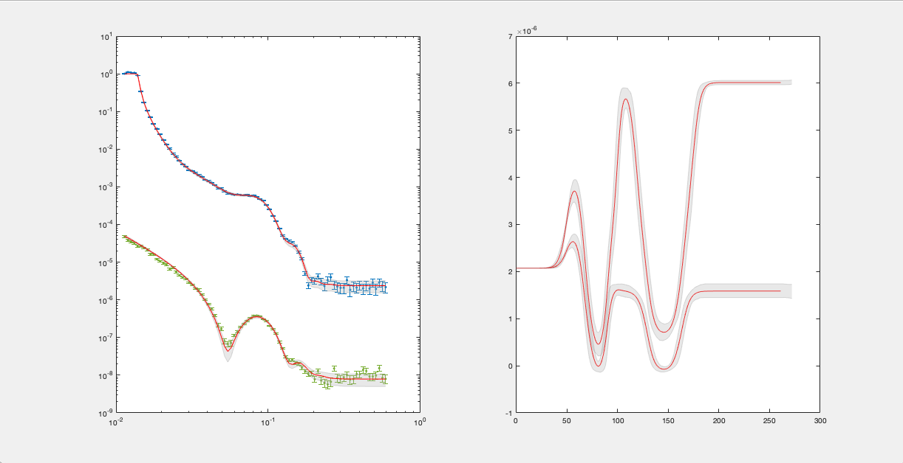
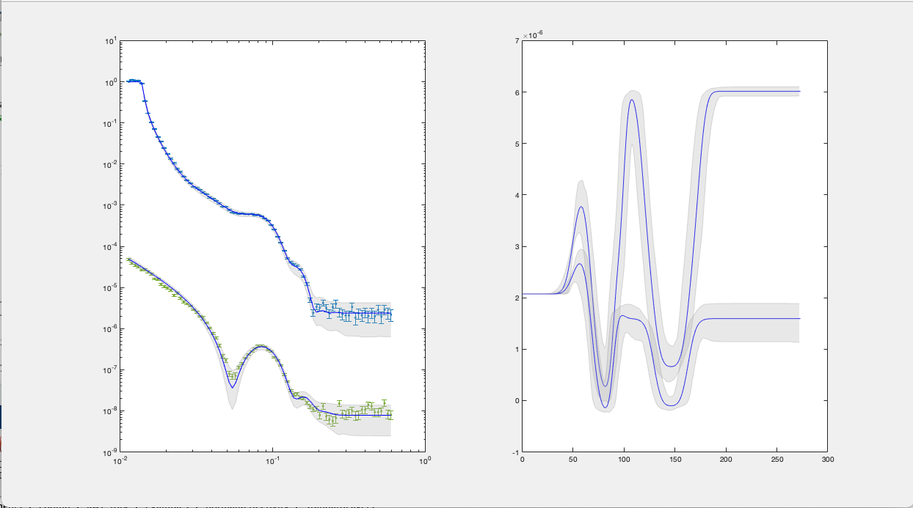
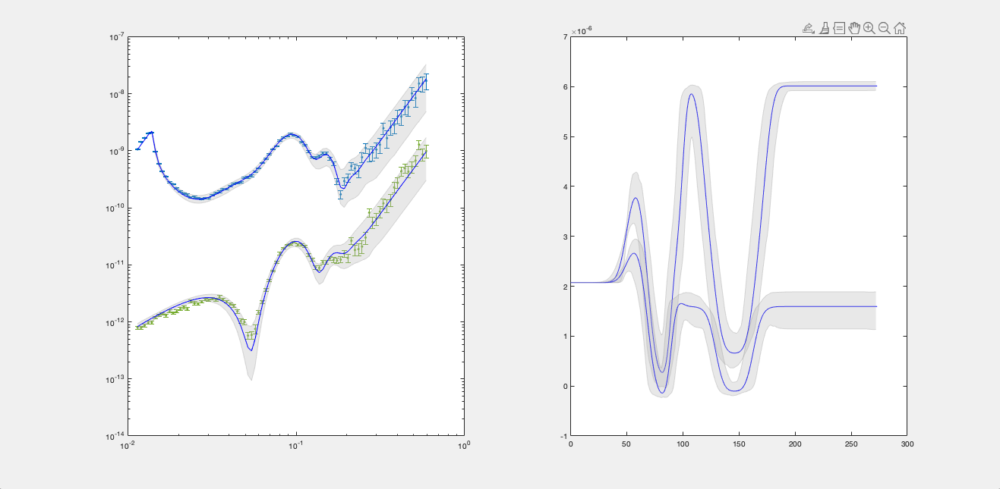
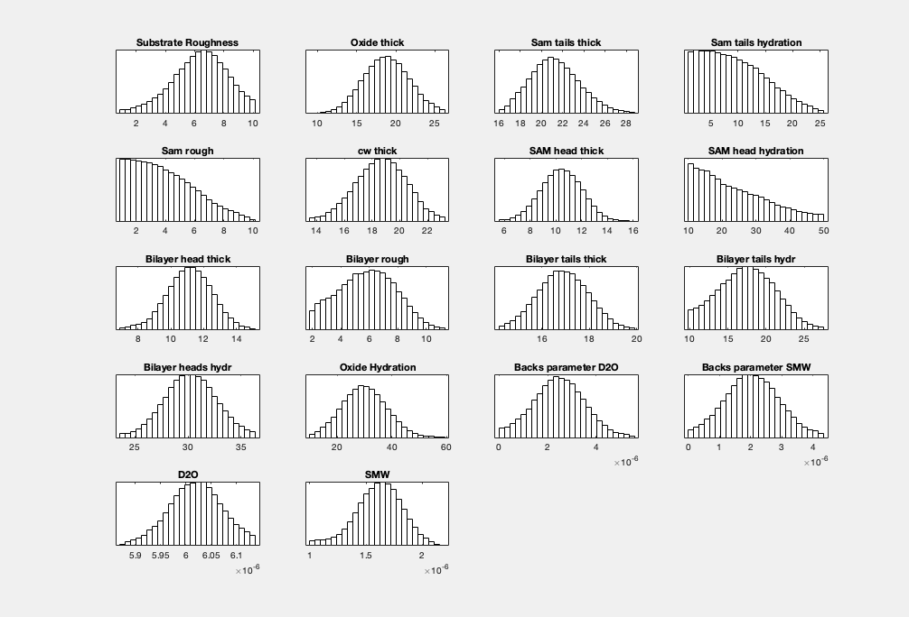
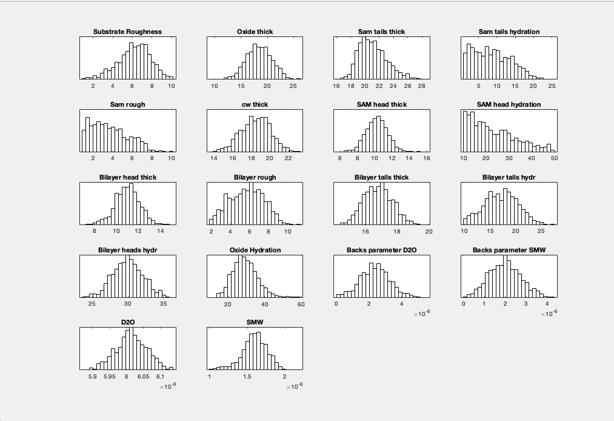
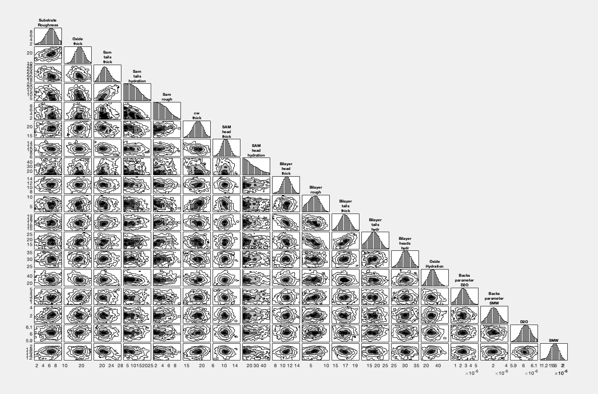
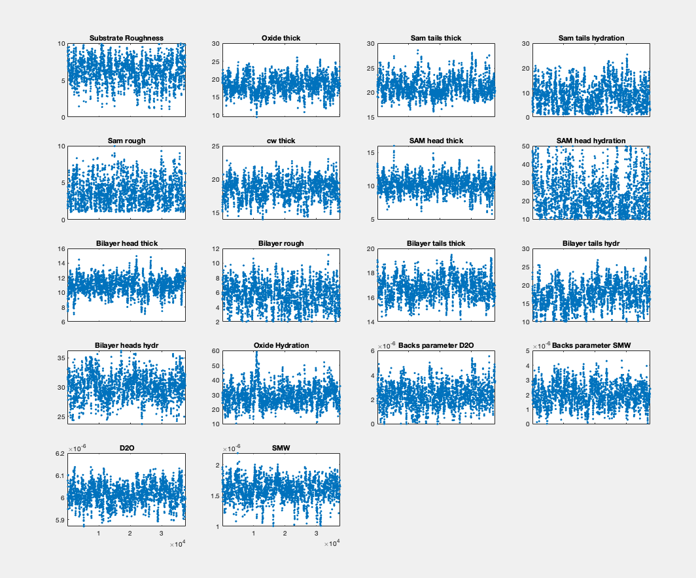

.. _bayesPlotting:

==========================
Plotting Bayesian Analysis
==========================

A number of function exist for plotting the results of Bayesian analysis.

Reflectivity and SLD
....................

A simple reflectivity shaded plot can be displayed as follows:

.. code-block:: MATLAB

    figure(1); clf
    bayesShadedPlot(problem,results)

By default, this shows a standard reflectivity plot with a 65% shaded confidence interval.

There are a number of options to customise the plot:

**Interval** - You can sepcify either the 65% or 95% confidence interval to display:

.. code-block:: MATLAB

    bayesShadedPlot(problem,results,'interval',95)

**Type** - You can also specify a q4 plot for the reflectivity:

Posterior Histograms
....................

You can easily view the marginalised Bayesian posteriors from your analysis:

.. code-block:: MATLAB

    plotHists(results)

By default, *plotHists* carries out a KDE smooth of the histograms. You can optionally choose no smoothing:

.. code-block:: MATLAB

    plotHists(results,'smooth',false)

Corner Plots
............

To produce a cornerplot, simply use the *cornerPlot* function:

.. code-block:: MATLAB

    cornerPlot(results)

Chain View
..........

Finally, you can check the integrity of your markov chain as follows:

.. code-block:: MATLAB

    mcmcplot(results.chain,[],results.fitNames,'chainpanel');

