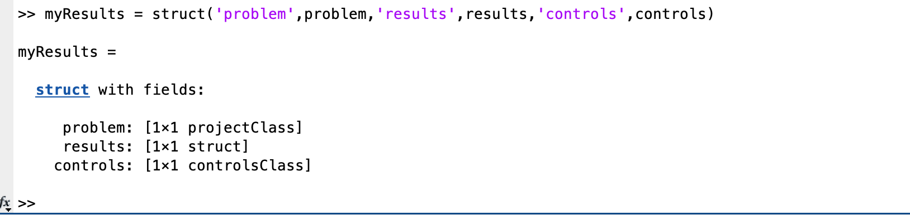
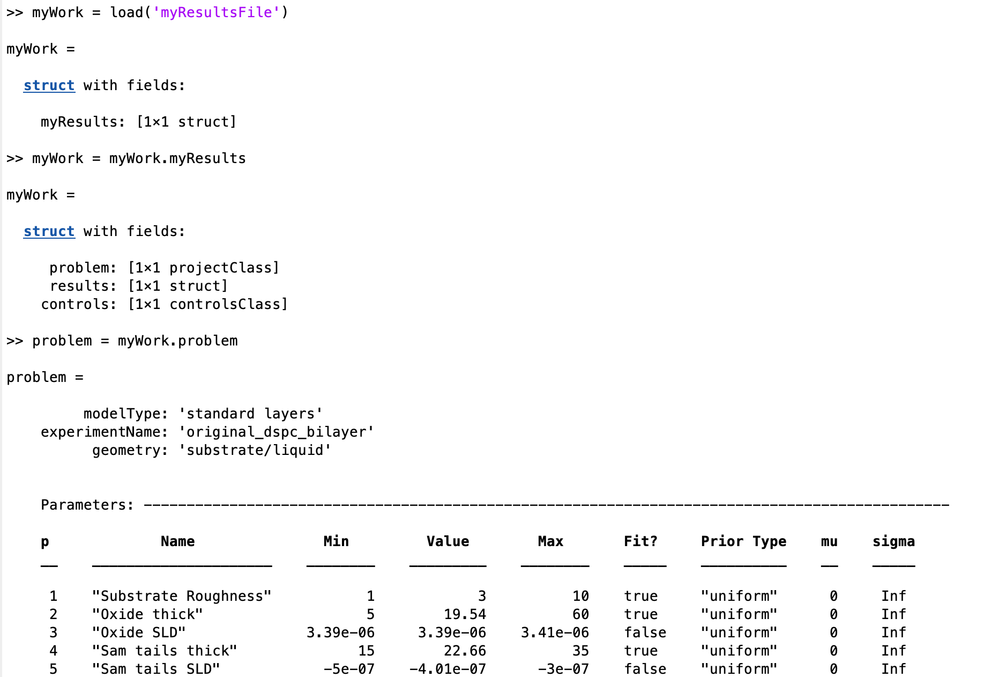
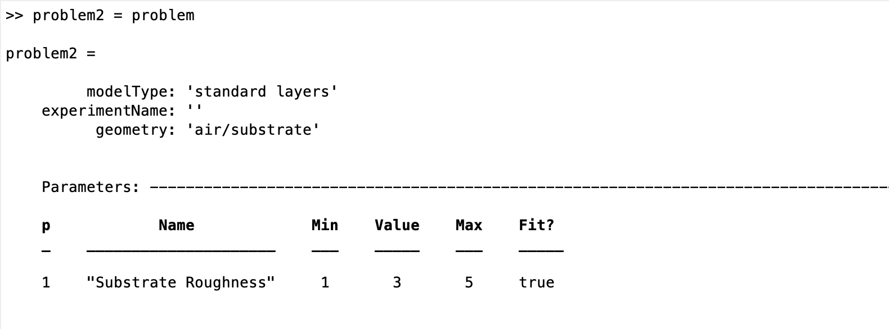
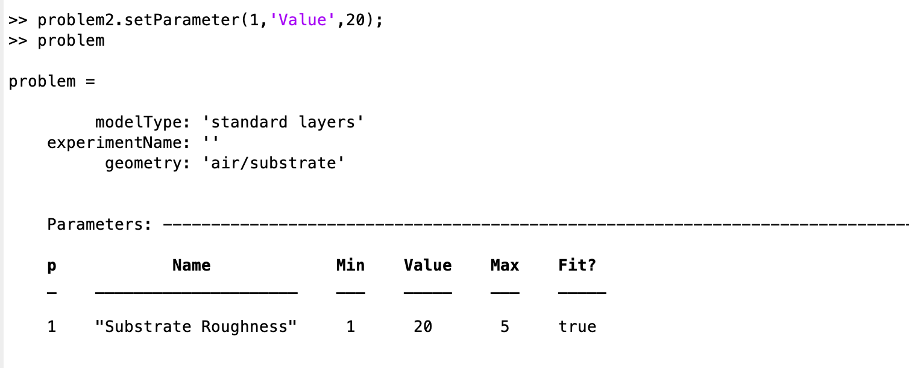

.. _savingAndClasses:

Saving Your Work (working with classes)
=======================================
When you have completed your analysis, usually uou will want to save a copy of your work for subsequent. Since everything about your model and results are contained
is their own classes (actually a struct for 'results'), this is very easy. But, there are a couple of pitfalls to be aware of..

Saving to a file
................
Suppose you have a model defined in problem, and you have run this through RAT and you want to save your work for later...

.. image:: images/userManual/chapter1/ratInput.png
    :width: 600
    :alt: RAT input model

SO. 'problem' now contains a copy of the input problem, and results the relevant reflectivities, SLD's and so on. Because everything is in these two outputs, then saving your mork is
just a matter of saving these to file. It's good practice to keep everything together, and a good way of doing this is to collect them into a struct...

Then, you only need to save the struct to a file to save all of your work:

.. code:: MATLAB

    save('myResultsFile','myResults');

At a later date, you only need to load back in your struct, split it up into it's components and away you go:

Copying projectClass
....................
During an analysis, it may be tempting to try to make a copy of your project, so that you can modify one of them in order to carry out some kind of comparison between them for example.
But, you need to be aware of how matlab deals with attempt to copy a class.

For example, first make an instance of projectClass:

.. image:: images/userManual/chapter3/copyProject1.png
    :width: 700
    :alt: copy project 1

Now, we try to make a copy:

If we then attempt to modify problem2, we find that the original problem has also changed!

In other words, *problem2 and problem 1 are references to the same instance of projectClass!* If you reall want a new instance,
you will need to save the class toa file, and load it into a new variable with a different name.

Exporting as a Script
.....................
Although saving a binary version of the class is useful, sometimes it would be better to have a script version which will reproduce the class. This is done using the
'toScript' method of projectClass:

.. code:: MATLAB:

    problem = projectClass();
    problem.writeScript(script = "myProjectScript");

Then, RAT will create a file containing all the statements needed to re-create your project:

.. code:: MATLAB:

    % THIS FILE IS GENERATED FROM RAT VIA THE "WRITESCRIPT" ROUTINE. IT IS NOT PART OF THE RAT CODE.

    project = createProject(name='', calcType='non polarised', model='standard layers', geometry='air/substrate', absorption=false);

    project.setParameterValue(1, 20);
    project.setParameterLimits(1, 1, 5);
    project.setParameterFit(1, true);
    project.setParameterPrior(1, 'uniform', 0, Inf);

    project.removeBulkIn(1);
    project.addBulkIn('SLD Air', 0, 0, 0, false, 'uniform', 0, Inf);

    project.removeBulkOut(1);
    project.addBulkOut('SLD D2O', 6.2e-06, 6.35e-06, 6.35e-06, false, 'uniform', 0, Inf);

    project.removeScalefactor(1);
    project.addScalefactor('Scalefactor 1', 0.02, 0.23, 0.25, false, 'uniform', 0, Inf);

    project.removeQzshift(1);
    project.addQzshift('Qz shift 1', -0.0001, 0, 0.0001, false, 'uniform', 0, Inf);

    project.removeBackgroundParam(1);
    project.addBackgroundParam('Background Param 1', 1e-07, 1e-06, 1e-05, false, 'uniform', 0, Inf);

    project.removeResolutionParam(1);
    project.addResolutionParam('Resolution par 1', 0.01, 0.03, 0.05, false, 'uniform', 0, Inf);

    project.removeBackground(1);
    project.removeResolution(1);

    project.addBackground('Background 1', 'constant', 'Background Param 1', '', '', '', '');

    project.addResolution('Resolution 1', 'constant', 'Resolution par 1', '', '', '', '');

    project.removeData(1);
    project.addData('Simulation');
    project.setData(1, 'simRange', [0.005 0.7]);

This is useful because you can then edit this file as you wish, to re-use it as a template for further projects.

.. note::

    Developers Note: We get that the format of the created file currently leaves something to desired! It works, but is very untidy..
    This will be cleaned up in a future release...

