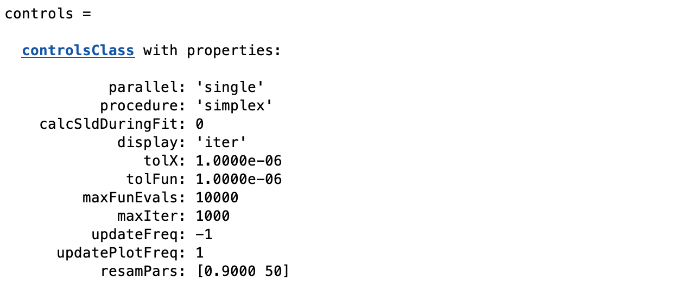

.. _simplex:

Nelder-Mead Simplex
...................

The Nelder-Mead simplex method for finding a local minimum of a function of several variables. For two variables, a simplex is a triangle, and
the method is a pattern search that compares function values at the three vertices of a
triangle. The worst vertex, where f (x, y) is largest, is rejected and replaced with a new
vertex. A new triangle is formed and the search is continued. The process generates
a sequence of triangles (which might have different shapes), for which the function
values at the vertices get smaller and smaller. The size of the triangles is reduced and
the coordinates of the minimum point are found.

The algorithm can extend to any number of dimensions, where to find the minimum of a function of N variables the simplex is then a generalized triangle in N dimensions. 
It is effective and computationally compact, and has the advantage of not requiring the gradient of the underlying function to be defined.

The main advantage of simplex methods for reflectivity is that they are robust in the face of competing local minima, and quickly converge to 
the region where the true global minimum lies. Finding the absolute local minimum for high dimensional problems can be slow however (i.e. simplex methods
are really Global Minimisers, and can be slow to converge locally).

To selct the simplex in RAT, we use the 'procedure' attribute of the controls block:-

.. code:: MATLAB

    controls = controlsClass();
    controls.procedure = 'simplex'

Then, a number of additional fields become visible in the controls block, which are the parameters
for the simplex:-

Many of these have been described in :ref:`controlsInfo`, but a few here are specific to the simplex:-

tolX - 

tolFun -

maxFunEvals -

updateFreq - 

updatePlotFreq - 

