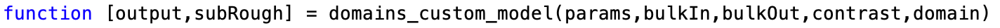
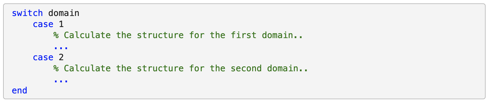

## Custom Layers example Using Domains

This is an example of using incoherent summing ('domains') from custom 
layers models.

These are broadly the same as normal custom layers models, except that the
input to the custom function contains an additional 'domains' parameter..

This operates in the same way as the 'contrast' input parameter in that it
tells the function which case it should calculate. It always has a value 
of 1 or 2, denoting which is the current domain.

Then, within the function, a choice is made as to which layer stack to 
generate...

===

