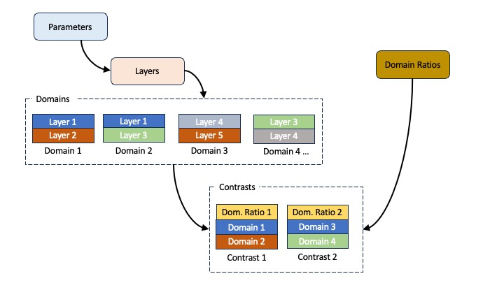
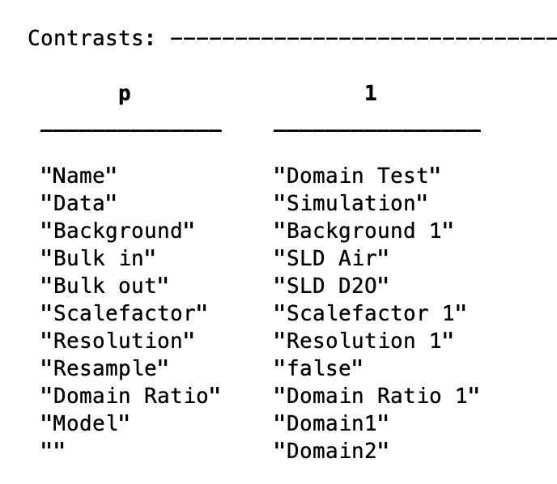

## 'Incoherent Summing' with Standard Layers

Analysing data containing domains using Standard Layers (SL) models is done in
a similar way to a normal standard layers model, but with a couple of 
additional steps. 

A normal SL model defines parameters, which are grouped into layers, and 
then these are arranged into contrasts. For domain containing samples, the 
layers are first grouped into domain 'contrasts', which are just groupings
of layers with none of the additional parameters of a contrast (such as resolutions
etc). Then, the actual _experimental_ contrasts are built in the usual way,
but with the model set as any two of the domains.

To control the ratio between the domains, we have an additional block in
projectClass for domain ratios. And each contrast has an additional field
for domain ratios which is set as one of the values from this block.

===

