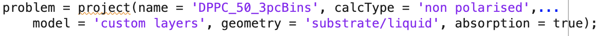
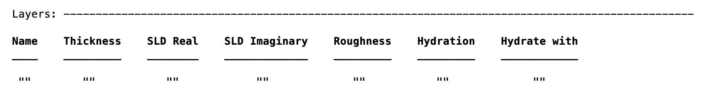
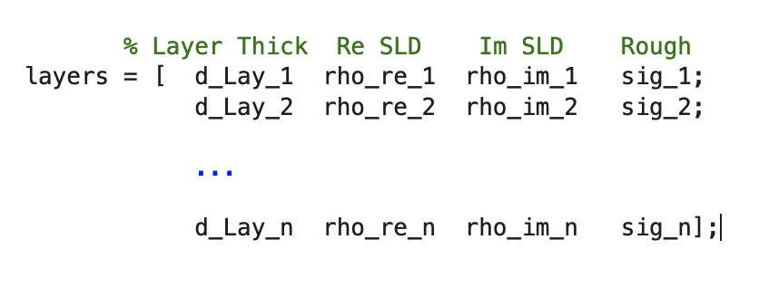
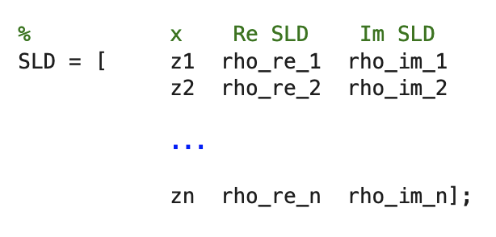
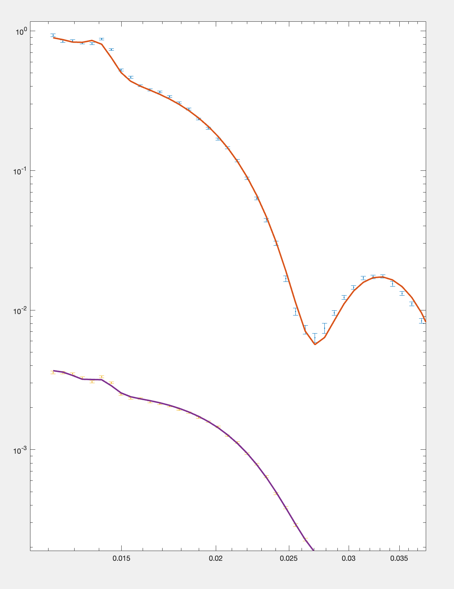

## Absorption (imaginary SLD) - effect below the critical edge.

RAT allows the use of an imaginary, as well as real part of the SLD. The effect
of this is usually seen below the critical edge, and must sometimes be accounted
for.

For all calculation types, to activate this functionality it is necessary to
activate the 'useImaginary' flag of the project..

Then, for Standard Layers, an additional column appears in the Layers block..

For Custom Layers, we add an extra column for the output...

.. and similarly, for Custom XY we use 3 columns for the SLD rather than 2..

The example used here is Custom Layers. It analyses a bilayer sample on a permalloy / gold
substrate, measured using polarised neutrons, against D2O and H2O, leading to
4 contrasts in total. Absorbtion (i.e. imaginary SLD) is defined for Gold and
the Permalloy, to account for non-flat data below the critical edge. 

As usual, in this example there is both a script (DPPC50_absorption.m), or a
worksheet (DPPC_absorption_worksheet.mlx).

===

