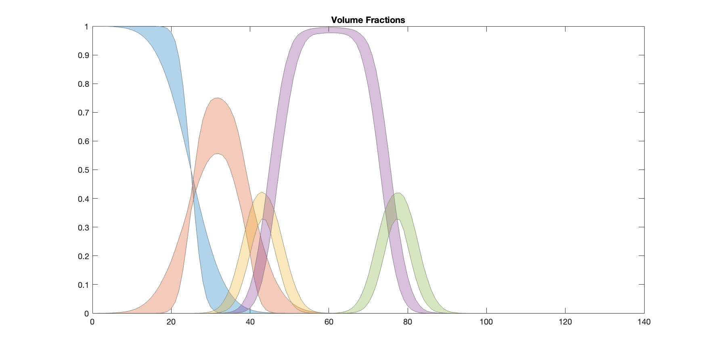

## Custom XY Example

This shows an example of using a 'custom XY' model to analyse reflectivity
from a supported bilayer of DSPC. 

The custom model used here is a Matlab model, which is in the file 'customXYDSPC.m'.

As for the Custom Layers example, we can make use of the fact that the volumes, and of course the
atomistic composition are known. So, for lipid tails for example, then we can
take a literature value for the tails volume, have a fittable parameter for the
lipid area per molecule, and then the tail thickness will simply be 

Tail Thick = Tail Volume / Lipid APM.

Since the volume is known, then the SLD of the tails is also obviously easily calculable.

In our model, we make distributions to represent the Volume Fractions of each of the
components in the sample, the convert these to SLD's, as described in 
Sheker et al, J. Appl. Phys, 100, 102216 (2011).

We also make our Volume Fractions as optional outputted parameters from our file.
The optional nature of this output means we can suppress it to run the model, then
activate it to make final output plots of our analysis....

As with all the examples, there is an m-file ('customXYDSPCScript.m'), or
a more detailed worksheet ('customXYDSPCSheet.mlx').
